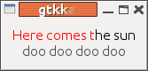

##  Displaying and colouring text with Gtk 


While there are many ways in which Karaoke text can be
displayed, a common pattern is to display two lines of
text, the currently playing line and the next one.
The current line is progressively highlighted and
on completion is
replaced by the next line.


In the Java chapter we did that. But the Java libraries have
not been polished and are distinctly slow and heavyweight.
They also seem to be low on Oracle's development schedule
for Java.
So here we look at an alternative GUI and make use of the
FluidSynth library. The Gtk library is chosen for reasons
outlined in an [earlier chapter](../../Diversions/Gtk/) on Gtk.


The first task is to build up an array of lyric lines
as the file is loaded. We are asssuming KAR format files
with upfront information as to title, etc, prefixed
by '@', and newlines prefixed by '\'.

```cpp

        
struct _lyric_t {
    gchar *lyric;
    long tick;
};
typedef struct _lyric_t lyric_t;

struct _lyric_lines_t {
    char *language;
    char *title;
    char *performer;
    GArray *lines; // array of GString *
};
typedef struct _lyric_lines_t lyric_lines_t;

GArray *lyrics;
lyric_lines_t lyric_lines;

void build_lyric_lines() {
    int n;
    lyric_t *plyric;
    GString *line = g_string_new("");
    GArray *lines =  g_array_sized_new(FALSE, FALSE, sizeof(GString *), 64);

    lyric_lines.title = NULL;

    for (n = 0; n < lyrics->len; n++) {
	plyric = g_array_index(lyrics, lyric_t *, n);
	gchar *lyric = plyric->lyric;
	int tick = plyric->tick;

	if ((strlen(lyric) >= 2) && (lyric[0] == '@') && (lyric[1] == 'L')) {
	    lyric_lines.language =  lyric + 2;
	    continue;
	}

	if ((strlen(lyric) >= 2) && (lyric[0] == '@') && (lyric[1] == 'T')) {
	    if (lyric_lines.title == NULL) {
		lyric_lines.title = lyric + 2;
	    } else {
		lyric_lines.performer = lyric + 2;
	    }
	    continue;
	}

	if (lyric[0] == '@') {
	    // some other stuff like @KMIDI KARAOKE FILE
	    continue;
	}

	if ((lyric[0] == '/') || (lyric[0] == '\\')) {
	    // start of a new line
	    // add to lines
	    g_array_append_val(lines, line);
	    line = g_string_new(lyric + 1);
	}  else {
	    line = g_string_append(line, lyric);
	}
    }
    lyric_lines.lines = lines;
    
    printf("Title is %s, performer is %s, language is %s\n", 
	   lyric_lines.title, lyric_lines.performer, lyric_lines.language);
    for (n = 0; n < lines->len; n++) {
	printf("Line is %s\n", g_array_index(lines, GString *, n)->str);
    }  
}
	
      
```


This is called from the onload callback

```cpp

	
int onload_callback(void *data, fluid_player_t *player) {
    long ticks = 0L;
    lyric_t *plyric;

    printf("Load callback, tracks %d \n", player->ntracks);
    int n;
    for (n = 0; n < player->ntracks; n++) {
	fluid_track_t *track = player->track[n];
	printf("Track %d\n", n);
	fluid_midi_event_t *event = fluid_track_first_event(track);
	while (event != NULL) {
	    switch (fluid_midi_event_get_type (event)) {
	    case MIDI_TEXT:
	    case MIDI_LYRIC:
		/* there's no fluid_midi_event_get_sysex()
		   or fluid_midi_event_get_time() so we 
		   have to look inside the opaque struct
		*/
		ticks += event->dtime;
		printf("Loaded event %s for time %d\n", 
		       event->paramptr,
		       ticks);
		plyric = g_new(lyric_t, 1);
		plyric->lyric = g_strdup(event->paramptr);
		plyric->tick = ticks;
		g_array_append_val(lyrics, plyric);
	    }
	    event = fluid_track_next_event(track);
	}
    }

    printf("Saved %d lyric events\n", lyrics->len);
    for (n = 0; n < lyrics->len; n++) {
	plyric = g_array_index(lyrics, lyric_t *, n);
	printf("Saved lyric %s at %d\n", plyric->lyric, plyric->tick);
    }

    build_lyric_lines();
}
	
      
```


The standard GUI part is to build an interface consisting of
two labels, one above the other to hold lines of lyrics.
This is just ordinary Gtk.


The final part is to handle lyric or text events from the
sequencer. If the event is a '\', then the current text
in a label must be replaced with new text, afer a small
pause. Otherwise, the text in the label has to be
progressively coloured to indicate what is next
to be played.


In the [earlier chapter](../../Diversions/Gtk/) on Gtk we discussed using Cairo to draw in pixbufs, and
Pango to structure the text. The Gtk Label understands
Pango directly, so we just use Pango to format the
text and display it in the label. This involves
constructing an HTML string with the first part coloured
red and the rest in black. This can be set in the label,
and there is no need to use Cairo.


The program is `gtkkaraoke_player.c` _Warning: the following program crashes regularly
	when trying to copy a Pango attribute list in the Gtk code
	for sizing
	a label. Debugging shows that the Pango copy function
	is set to NULL somewhere in Gtk, and shouldn't be. 
	I have no fix as yet and haven't replicated the bug 
	in a simple enough way to log a bug report._ 

```cpp

#include <fluidsynth.h>
#include <fluid_midi.h>
#include <string.h>

#include <gtk/gtk.h>

/* GString stuff from https://developer.gnome.org/glib/2.31/glib-Strings.html
   Memory alloc from https://developer.gnome.org/glib/2.30/glib-Memory-Allocation.html
   Packing demo from https://developer.gnome.org/gtk-tutorial/2.90/x386.html
   Thread stuff from https://developer.gnome.org/gtk-faq/stable/x481.html
   GArrays from http://www.gtk.org/api/2.6/glib/glib-Arrays.html
   Pango attributes from http://www.ibm.com/developerworks/library/l-u-pango2/
   Timeouts at http://www.gtk.org/tutorial1.2/gtk_tut-17.html
 */

struct _lyric_t {
    gchar *lyric;
    long tick;

};
typedef struct _lyric_t lyric_t;

struct _lyric_lines_t {
    char *language;
    char *title;
    char *performer;
    GArray *lines; // array of GString *
};
typedef struct _lyric_lines_t lyric_lines_t;

GArray *lyrics;

lyric_lines_t lyric_lines;

fluid_synth_t* synth;

GtkWidget *lyric_labels[2];

fluid_player_t* player;

int current_panel = -1;  // panel showing current lyric line
int current_line = 0;  // which line is the current lyric
gchar *current_lyric;   // currently playing lyric line
GString *front_of_lyric;  // part of lyric to be coloured red
GString *end_of_lyric;    // part of lyric to not be coloured

gchar *markup[] = {"<span foreground=\"red\">",
		   "</span><span foreground=\"black\">",
		   "</span>"};
gchar *markup_newline[] = {"<span foreground=\"black\">",
		   "</span>"};
GString *marked_up_label;

struct _reset_label_data {
    GtkLabel *label;
    gchar *text;
    PangoAttrList *attrs;
};

typedef struct _reset_label_data reset_label_data;

/**
 * redraw a label some time later
 */
gint reset_label_cb(gpointer data) {
    reset_label_data *rdata = ( reset_label_data *) data;

    if (rdata->label == NULL) {
	printf("Label is null, cant set its text \n");
	return FALSE;
    }

    printf("Resetting label callback to \"%s\"\n", rdata->text);

    gdk_threads_enter();

    gchar *str;
    str = g_strconcat(markup_newline[0], rdata->text, markup_newline[1], NULL);

    PangoAttrList *attrs;
    gchar *text;
    pango_parse_markup (str, -1,0, &attrs, &text, NULL, NULL);
 
    gtk_label_set_text(rdata->label, text);
    gtk_label_set_attributes(rdata->label, attrs);

    gdk_threads_leave();

    GtkAllocation* alloc = g_new(GtkAllocation, 1);
    gtk_widget_get_allocation((GtkWidget *) (rdata->label), alloc);
    printf("Set label text to \"%s\"\n", gtk_label_get_text(rdata->label));
    printf("Label has height %d width %d\n", alloc->height, alloc->width);
    printf("Set other label text to \"%s\"\n", 
	   gtk_label_get_text(rdata->label == lyric_labels[0] ?
			      lyric_labels[1] : lyric_labels[0]));
    gtk_widget_get_allocation((GtkWidget *) (rdata->label  == lyric_labels[0] ?
			      lyric_labels[1] : lyric_labels[0]), alloc);
    printf("Label has height %d width %d\n", alloc->height, alloc->width);

    return FALSE;
}


/**
 * This MIDI event callback filters out the TEXT and LYRIC events
 * and passes the rest to the default event handler.
 * Here we colour the text in a Gtk label
 */
int event_callback(void *data, fluid_midi_event_t *event) {
    fluid_synth_t* synth = (fluid_synth_t*) data;
    int type = fluid_midi_event_get_type(event);
    int chan = fluid_midi_event_get_channel(event);
    if (synth == NULL) printf("Synth is null\n");
    switch(type) {
    case MIDI_TEXT:
	printf("Callback: Playing text event %s (length %d)\n", 
	       (char *) event->paramptr, event->param1);

	if (((char *) event->paramptr)[0] == '\\') {
	    // we've got a new line, change the label text on the NEXT panel
	    int next_panel = current_panel; // really (current_panel+2)%2
	    int next_line = current_line + 2;
	    gchar *next_lyric;

	    if (current_line + 2 >= lyric_lines.lines->len) {
		return FLUID_OK;
	    }
	    current_line += 1;
	    current_panel = (current_panel + 1) % 2;

	    // set up new line as current line
	    char *lyric =  event->paramptr;

	    // find the next line from lyric_lines array
	    current_lyric = g_array_index(lyric_lines.lines, GString *, current_line)->str;

	    // lyric is in 2 parts: front coloured, end uncoloured
	    front_of_lyric = g_string_new(lyric+1); // lose \
	    end_of_lyric = g_string_new(current_lyric);
	    printf("New line. Setting front to %s end to \"%s\"\n", lyric+1, current_lyric); 

	    // update label for next line after this one
	    char *str = g_array_index(lyric_lines.lines, GString *, next_line)->str;
	    printf("Setting text in label %d to \"%s\"\n", next_panel, str);

	    next_lyric = g_array_index(lyric_lines.lines, GString *, next_line)->str;
	   
	    gdk_threads_enter();

	    // change the label after one second to avoid visual "jar"
	    reset_label_data *label_data;
	    label_data = g_new(reset_label_data, 1);
	    label_data->label = (GtkLabel *) lyric_labels[next_panel];
	    label_data->text = next_lyric;
	    g_timeout_add(1000, reset_label_cb, label_data);

	    // Dies if you try to flush at this point!
	    // gdk_flush();

	    gdk_threads_leave();
	} else {
	    // change text colour as chars are played, using Pango attributes
	    char *lyric =  event->paramptr;
	    if ((front_of_lyric != NULL) && (lyric != NULL)) {
		// add the new lyric to the front of the existing coloured
		g_string_append(front_of_lyric, lyric);
		char *s = front_of_lyric->str;
		printf("Displaying \"%s\"\n", current_lyric);
		printf("  Colouring \"%s\"\n", s);
		printf("  Not colouring \"%s\"\n", current_lyric + strlen(s));

		// todo: avoid memory leak
		marked_up_label = g_string_new(markup[0]);
		g_string_append(marked_up_label, s);
		g_string_append(marked_up_label, markup[1]);
		g_string_append(marked_up_label, current_lyric + strlen(s));
		g_string_append(marked_up_label, markup[2]);
		printf("Marked up label \"%s\"\n", marked_up_label->str);

		/* Example from http://www.ibm.com/developerworks/library/l-u-pango2/
		 */
		PangoAttrList *attrs;
		gchar *text;
		gdk_threads_enter();
		pango_parse_markup (marked_up_label->str, -1,0, &attrs, &text, NULL, NULL);
		printf("Marked up label parsed ok\n");
		gtk_label_set_text((GtkLabel *) lyric_labels[current_panel], 
				   text);
		gtk_label_set_attributes(GTK_LABEL(lyric_labels[current_panel]), attrs);
		// Dies if you try to flush at this point!
		//gdk_flush();
		
		gdk_threads_leave();
	    }
	}
	return  FLUID_OK;

    case MIDI_LYRIC:
	printf("Callback: Playing lyric event %d %s\n", 
	       event->param1, (char *) event->paramptr);
	return  FLUID_OK;
    
    case MIDI_EOT:
	printf("End of track\n");
	exit(0);
    }
    // default handler for all other events
    return fluid_synth_handle_midi_event( data, event);
}

/*
 * Build array of lyric lines from the MIDI file data
 */
void build_lyric_lines() {
    int n;
    lyric_t *plyric;
    GString *line = g_string_new("");
    GArray *lines =  g_array_sized_new(FALSE, FALSE, sizeof(GString *), 64);

    lyric_lines.title = NULL;

    for (n = 0; n < lyrics->len; n++) {
	plyric = g_array_index(lyrics, lyric_t *, n);
	gchar *lyric = plyric->lyric;
	int tick = plyric->tick;

	if ((strlen(lyric) >= 2) && (lyric[0] == '@') && (lyric[1] == 'L')) {
	    lyric_lines.language =  lyric + 2;
	    continue;
	}

	if ((strlen(lyric) >= 2) && (lyric[0] == '@') && (lyric[1] == 'T')) {
	    if (lyric_lines.title == NULL) {
		lyric_lines.title = lyric + 2;
	    } else {
		lyric_lines.performer = lyric + 2;
	    }
	    continue;
	}

	if (lyric[0] == '@') {
	    // some other stuff like @KMIDI KARAOKE FILE
	    continue;
	}

	if ((lyric[0] == '/') || (lyric[0] == '\\')) {
	    // start of a new line
	    // add to lines
	    g_array_append_val(lines, line);
	    line = g_string_new(lyric + 1);
	}  else {
	    line = g_string_append(line, lyric);
	}
    }
    lyric_lines.lines = lines;
    
    printf("Title is %s, performer is %s, language is %s\n", 
	   lyric_lines.title, lyric_lines.performer, lyric_lines.language);
    for (n = 0; n < lines->len; n++) {
	printf("Line is %s\n", g_array_index(lines, GString *, n)->str);
    }
    
}

/**
 * This is called whenever new data is loaded, such as a new file.
 * Here we extract the TEXT and LYRIC events and save them
 * into an array
 */ 
int onload_callback(void *data, fluid_player_t *player) {
    long ticks = 0L;
    lyric_t *plyric;

    printf("Load callback, tracks %d \n", player->ntracks);
    int n;
    for (n = 0; n < player->ntracks; n++) {
	fluid_track_t *track = player->track[n];
	printf("Track %d\n", n);
	fluid_midi_event_t *event = fluid_track_first_event(track);
	while (event != NULL) {
	    switch (fluid_midi_event_get_type (event)) {
	    case MIDI_TEXT:
	    case MIDI_LYRIC:
		/* there's no fluid_midi_event_get_sysex()
		   or fluid_midi_event_get_time() so we 
		   have to look inside the opaque struct
		*/
		ticks += event->dtime;
		printf("Loaded event %s for time %ld\n", 
		       (char *) event->paramptr,
		       ticks);
		plyric = g_new(lyric_t, 1);
		plyric->lyric = g_strdup(event->paramptr);
		plyric->tick = ticks;
		g_array_append_val(lyrics, plyric);
	    }
	    event = fluid_track_next_event(track);
	}
    }


    printf("Saved %d lyric events\n", lyrics->len);
    for (n = 0; n < lyrics->len; n++) {
	plyric = g_array_index(lyrics, lyric_t *, n);
	printf("Saved lyric %s at %ld\n", plyric->lyric, plyric->tick);
    }

    build_lyric_lines();

    // stick the first two lines into the labels so we can see
    // what is coming
    gdk_threads_enter();
    char *str = g_array_index(lyric_lines.lines, GString *, 1)->str;
    gtk_label_set_text((GtkLabel *) lyric_labels[0], str);
    str = g_array_index(lyric_lines.lines, GString *, 2)->str;
    gtk_label_set_text((GtkLabel *) lyric_labels[1], str);
    // gdk_flush ();
    
    /* release GTK thread lock */
    gdk_threads_leave();
    
    return FLUID_OK;
}

/* Called when the windows are realized
 */
static void realize_cb (GtkWidget *widget, gpointer data) {
    /* now we can play the midi files, if any */
    fluid_player_play(player);
}

static gboolean delete_event( GtkWidget *widget,
                              GdkEvent  *event,
                              gpointer   data )
{
    /* If you return FALSE in the "delete-event" signal handler,
     * GTK will emit the "destroy" signal. Returning TRUE means
     * you don't want the window to be destroyed.
     * This is useful for popping up 'are you sure you want to quit?'
     * type dialogs. */

    g_print ("delete event occurred\n");

    /* Change TRUE to FALSE and the main window will be destroyed with
     * a "delete-event". */

    return TRUE;
}

/* Another callback */
static void destroy( GtkWidget *widget,
                     gpointer   data )
{
    gtk_main_quit ();
}

int main(int argc, char** argv)
{

    /* set up the fluidsynth stuff */
    int i;
    fluid_settings_t* settings;

    fluid_audio_driver_t* adriver;
    settings = new_fluid_settings();
    fluid_settings_setstr(settings, "audio.driver", "alsa");
    fluid_settings_setint(settings, "synth.polyphony", 64);
    fluid_settings_setint(settings, "synth.reverb.active", FALSE);
    fluid_settings_setint(settings, "synth.sample-rate", 22050);
    synth = new_fluid_synth(settings);
    player = new_fluid_player(synth);

    lyrics = g_array_sized_new(FALSE, FALSE, sizeof(lyric_t *), 1024);

    /* Set the MIDI event callback to our own functions rather than the system default */
    fluid_player_set_playback_callback(player, event_callback, synth);

    /* Add an onload callback so we can get information from new data before it plays */
    fluid_player_set_onload_callback(player, onload_callback, NULL);

    adriver = new_fluid_audio_driver(settings, synth);
    /* process command line arguments */
    for (i = 1; i < argc; i++) {
        if (fluid_is_soundfont(argv[i])) {
	    fluid_synth_sfload(synth, argv[1], 1);
        } else {
            fluid_player_add(player, argv[i]);
        }
    }

    // Gtk stuff now

   /* GtkWidget is the storage type for widgets */
    GtkWidget *window;
    GtkWidget *button;
    GtkWidget *lyrics_box;

    
    /* This is called in all GTK applications. Arguments are parsed
     * from the command line and are returned to the application. */
    gtk_init (&argc, &argv);
    
    /* create a new window */
    window = gtk_window_new (GTK_WINDOW_TOPLEVEL);
    
    /* When the window is given the "delete-event" signal (this is given
     * by the window manager, usually by the "close" option, or on the
     * titlebar), we ask it to call the delete_event () function
     * as defined above. The data passed to the callback
     * function is NULL and is ignored in the callback function. */
    g_signal_connect (window, "delete-event",
		      G_CALLBACK (delete_event), NULL);
    
    /* Here we connect the "destroy" event to a signal handler.  
     * This event occurs when we call gtk_widget_destroy() on the window,
     * or if we return FALSE in the "delete-event" callback. */
    g_signal_connect (window, "destroy",
		      G_CALLBACK (destroy), NULL);

    g_signal_connect (window, "realize", G_CALLBACK (realize_cb), NULL);
    
    /* Sets the border width of the window. */
    gtk_container_set_border_width (GTK_CONTAINER (window), 10);

    // Gtk 3.0 deprecates gtk_vbox_new in favour of gtk_grid
    // but that isn't in Gtk 2.0, so we ignore warnings for now
    lyrics_box = gtk_vbox_new(TRUE, 1);
    gtk_widget_show(lyrics_box);

    char *str = "  ";
    lyric_labels[0] = gtk_label_new(str);
    lyric_labels[1] = gtk_label_new(str);

    gtk_widget_show (lyric_labels[0]);
    gtk_widget_show (lyric_labels[1]);

    
    gtk_box_pack_start (GTK_BOX (lyrics_box), lyric_labels[0], TRUE, TRUE, 0);
    gtk_box_pack_start (GTK_BOX (lyrics_box), lyric_labels[1], TRUE, TRUE, 0);

    /* This packs the button into the window (a gtk container). */
    gtk_container_add (GTK_CONTAINER (window), lyrics_box);
        
    /* and the window */
    gtk_widget_show (window);
    
    /* All GTK applications must have a gtk_main(). Control ends here
     * and waits for an event to occur (like a key press or
     * mouse event). */
    gtk_main ();
    
    /* wait for playback termination */
    fluid_player_join(player);
    /* cleanup */
    delete_fluid_audio_driver(adriver);
    delete_fluid_player(player);
    delete_fluid_synth(synth);
    delete_fluid_settings(settings);
    return 0;
}


      
```


When run it looks like



