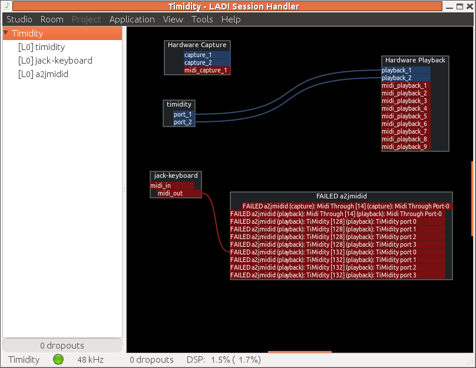

##  Playing MIDI 

The major synthesizer engines TiMidity and FluidSynth
will output to ALSA devices. To bring them into the
Jack world, Jack needs to be started with the `-Xseq`option or for `a2jmidid`to be run.

We can try to manage the connections using the Jack
session manager (e.g. `qjackctl`).
But this hits a snag using the MIDI synthesizers
such as TiMidity or FluidSynth
since they assume a PulseAudio output rather
than Jack output.
Restoring a session fails to restore the synthesizer
with Jack output.

We can try to manage the connections using LADSPA.
Unfortunately I have so far been unable to manage
the Jack server settings using `gladish`.
So it starts Jack using the default ALSA settings
and doesn't use the `-Xseq`setting
to map the ALSA ports to Jack.
We need to start `a2jmidid`and then it can succesfully manage a session of e.g `timidity`, `jack_keyboard`and `a2jmidid`.

Even then, the connection diagram looks a mess:
LADISH playing MIDI