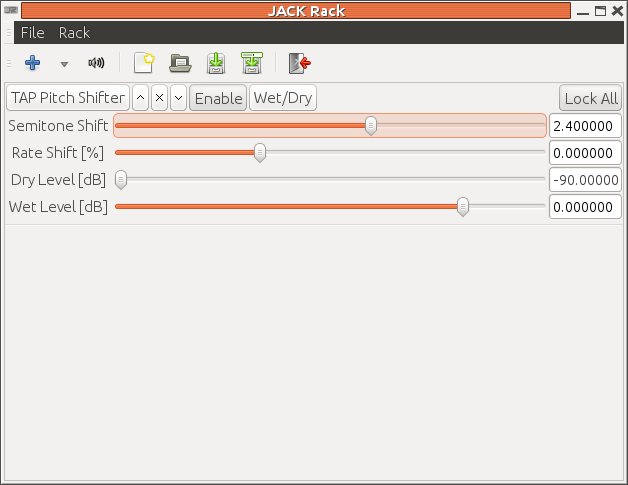
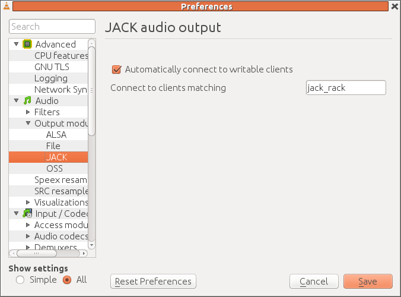
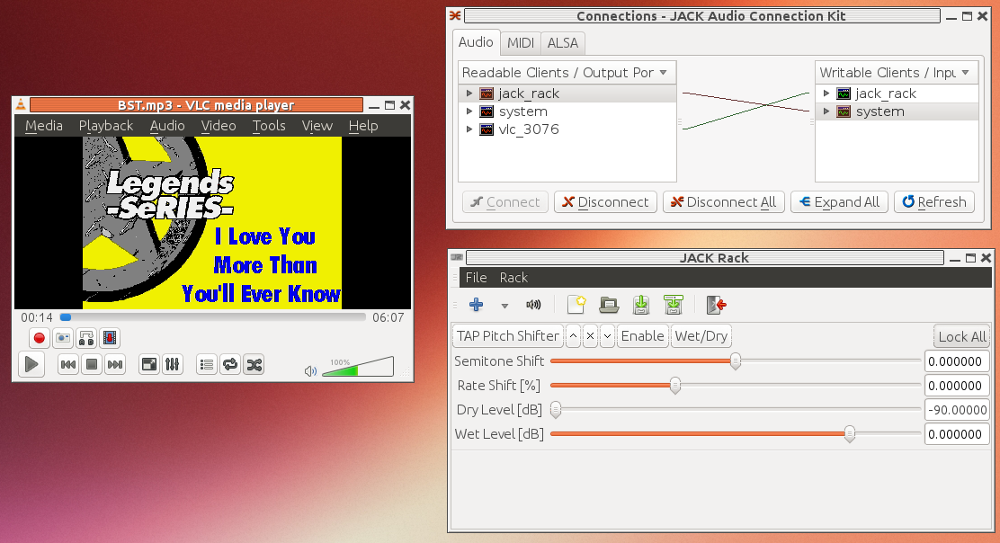

#  Playing MP3+G with Jack Rack pitch shifting

The player
 `vlc`will play MP3+G files.
      Often the MP3+G is a zipped files containing both
      an MP3 file and CDG file with the same root. 
      This must be unzipped, and then can be played by giving
 `vlc`the MP3 filename:
```sh_cpp
vlc file.mp3

```
This will pick up the CDG file and display the lyrics.


 `vlc`can be used with Jack by the
 `--aout jack`option
```sh_cpp
vlc --aout jack file.mp3

```


One of the common requests for
 `vlc`is to have
      a "pitch control" mechanism. While it should be possible to add
      LADPSA pitch controls to
 `vlc`, no-one has got
      around to it yet. But we can still add LADSPA effects
      through
 `jack-rack`.

The steps are

+  You may need to stop
 `pulseaudio`temporarily
	  by e.g
 `pasuspender cat`


+  Start the Jack daemon running as usual by
```sh_cpp
jackd -d alsa

```


+  Start
 `qjackctl`so you have some control
	  over Jack connections


+  Start
 `jack-rack`. Using the '+' button,
	  select Frequency -
>
Pitch shifters -
>
TAP Pitch Shifter.
	  Don't forget to Enable it, so it should look like



Note that in
 `qjackctl`,
 `jack-rack`shows as
 `jack_rack`- the minus has been
	  replaced by an underscore, and is the proper Jack
	  name of
 `jack-rack`. Connect the output
	  of
 `jack-rack`to
 `system`.


+  Now start
 `vlc --aout jack`so we can set up
	  the correct configuration. Choose Tools -
>
Preferences,
	  and in "Show settings" set the radio button to "All".
	  Then under Audio -
>
Output modules -
>
Jack
	  check "Automatically connect to writable clients" 
	  and connect to clients matching "jack_rack"
	  (note the underscore). This should look like





+  Next time you start
 `vlc`by e.g.
 `vlc --aout jack BST.mp3`,
 `qjackctl`should show


and the music should play through
 `jack-rack`where you can adjust the pitch.


The result of this with
 `vlc`playing MP3 audio
      through the pitch filter and also showing the CDG video
      should look like





