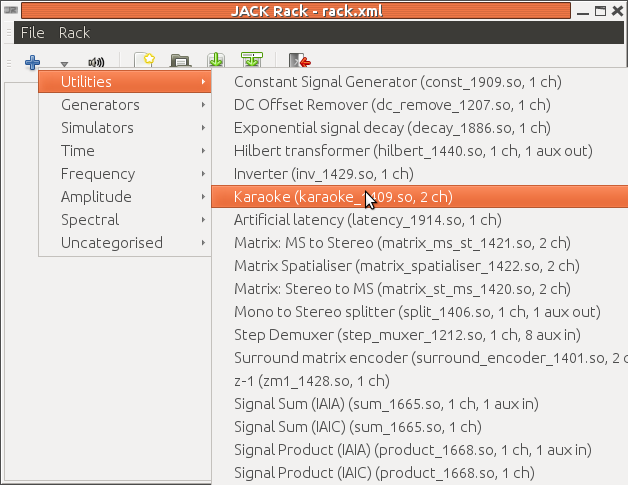
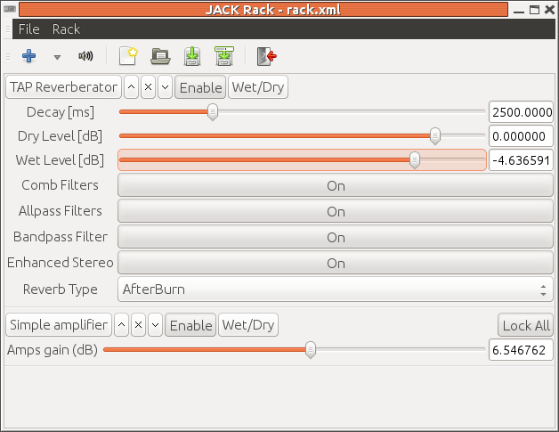

##  Using jack rack for effects 


Karaoke takes inputs from MIDI sources and from
      microphones. These are mixed together.
      Generally there is an overall volume
      control but there is usually a volume control
      for the microphones as well.
      While the MIDI source should be passed straight through,
      it is common to apply a reverb effect to the microphones.


These are all effects that can be supplied by
      LADSPA modules (see the [LADSPA](../../DSP/LADSPA/) chapter).
      The Jack application `jack-rack`makes these plugins accessible to Jack
      applications so that LADSPA effects can be applied
      to Jack pipelines.


It is fairly straighforward to add a module
      to a session. Click on the "+" button and
      choose from the enormous menu of effects.
      For example, choosing the Karaoke plugin
      from the Utilities menu looks like





Some of the modules that might be relevant are

+ Karaoke (number 1409) which shows under the Utilities menu.
	  This will attempt to remove centre vocals from a music
	  track.
+ There are a number of reverb modules which show
	  under the Simulators -> Reverb menus
+ GVerb
+ Plate reverb
+ TAP reverberator (from the TAP plugins)

The TAP reverberator seems to be the most
	  full featured (but is not guaranteed to be realtime).

+ There are a number of amplifiers under
	  Amplitude -> Amplifiers


Multiple modules may be applied in a single `jack-rack`application, and
      multiple applications can be run.
      For example, to apply a volume control to a microphone
      and then apply reverb before sending to the speakers
      can be done by adding  the TAP reverberator and then
      one of the amplifiers. This looks like
Jack Rack with reverb and amplifier plugins

I'm running this on a USB Sound Blaster TruStudioPro.
      This is only 16-bits and I can't seem to find a suitable
      Jack hardware configuration.
      So I'm running Jack by hand using a plug device,
      which Jack complains about but works anyway:

```

	 
jackd -dalsa -dplughw:2 -r 48000
	 
       
```


Although `gladish`can see it under its
      Jack configuration menu,
      I haven't managed to get `gladish`to
      accept the SoundBlaster as a setting - so far I can only
      manage to get Jack running under as a plug device
      and gladish keeps swapping it back to a hardware
      device.


 `qjackctl`does an okay job of
      saving and restoring sessions, starting `jack-rack`with its correct
      plugins and their settings, and linking
      it to the correct capture and playback ports.


