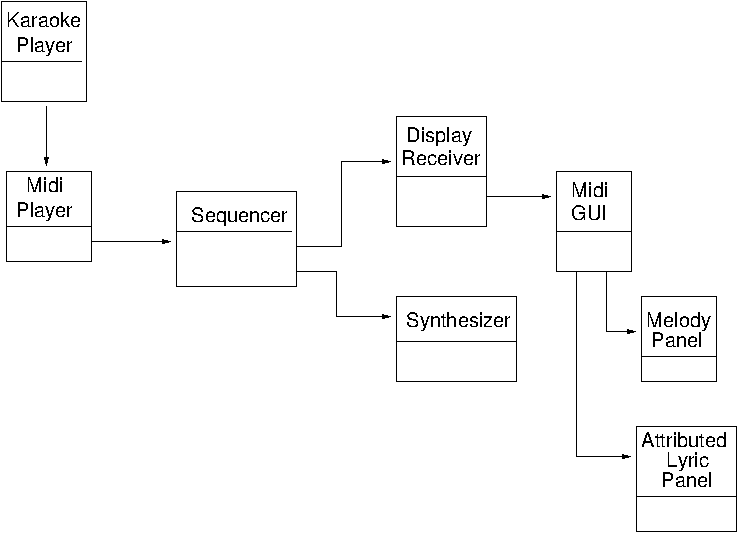

##  Introduction 

Java has no library support for Karaoke. That is too application specific.
      In this chapter we give code for a Karaoke player that can play KAR files.
      The player will show two lines of the lyrics to be played, with words already
      played beigin highlighted in red.
      Along the top
      it shows using a simple piano
      keyboard the notes that are played in channel one of the MIDI file.
      In the middle it shows the melody line, with a vertical line in the middle
      to show the currently playing note.

The player looks like

The UML diagram is basically

