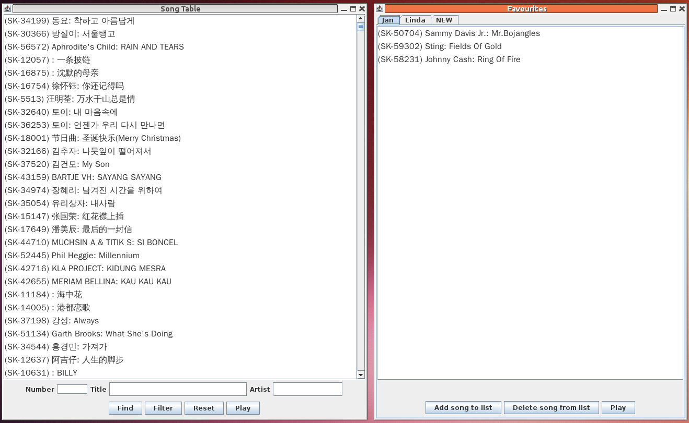
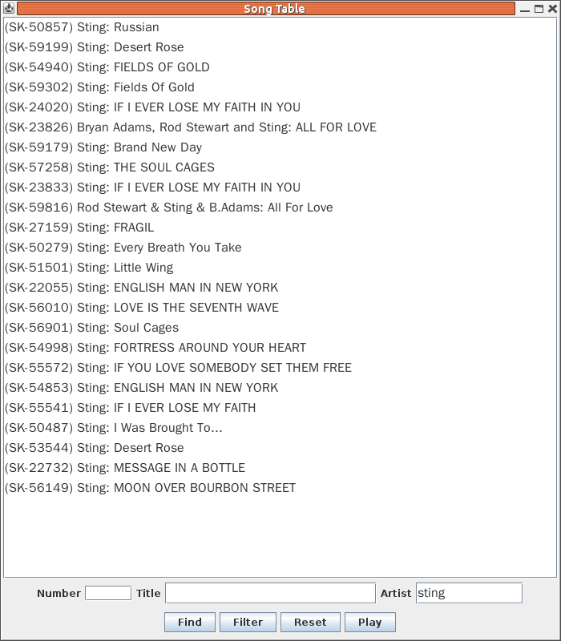

#  Introduction 

In the chapter on
 [ User level Karaoke tools] (../User/)
we discussed the MP3+G format for Karaoke.
      Each "song" consists of two files: an MP3 file for the audio
      and a low-quality CDG file for the video (mainly the lyrics).
      Often this pair of files are zipped together.

Files can be extracted from CDG Karaoke disks by using
 `cdrdao`and
 `cdgrip.py`.
      They can be played by
 `vlc`when given the
      MP3 file as argument - it wil pick up the CDG file from
      the same directory.

Many people will have built up a sizeable collection of
      MP3+G songs. In this chapter we consider how to list and play
      them, along with keeping lists of favourite songs.
      The chapter just looks at a Java application to perform
      this, and is really just standard Swing and Android programming.
      There are no special audio or Karaoke features
      considered in this chapter.

I keep my files on a server. I can access them in many ways on 
      the other computers in the house: SAMBA shares, HTTP downloads,
      SSH file system (sshfs), etc. Some mechanisms are less portable than
      others; for example sshfs is not a standard Windows application
      and SMB/SAMBA is not a standard Android client. So after getting
      everything working using sshfs (a no-brainer under standard Linux),
      I then converted the applications to HTTP access.
      This has its own wrinkles :-).

The environment looks like

The Java client application for Linux and Windows looks like

MP3+G player

This shows the main window of songs and on its right
      the favourites window for two people, Jan and Linda.
      The application handles multiple languages - english,
      korean and chinese are shown.

Filters can be applied to the main song list. For example,
      filtering on the singer Sting gives

Songs by Sting

The Android application looks like
      XXX

When
 `Play`is clicked, information about the selection
      is sent to the media player - currently a CubieBoard2 connected
      to my hifi/TV. The media computer fetches the files from
      the HTTP server.
      Files are played on the media computer using
 `vlc`as it can 
      handle MP3+G files.

