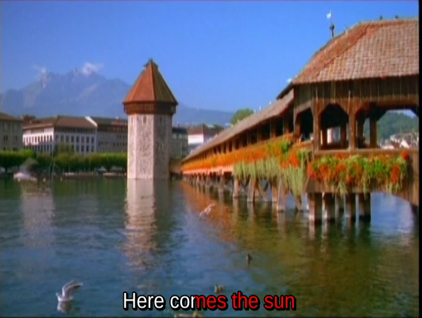

##  Karaoke effects in ASS files 


A line in an ASS file essentially consists of a time to start
display, a time to finish the display and the text itself.
However, Karaoke users are accustomed to the text being
highlighted as it is played.


ASS supports two major highlight styles:

+ Words are highlighted one at a time
+ The text is highlighted by filling from the left

These effects are done by embedding "Karaoke overrides"
into the text. These are in {} brackets with a duration
time in hundredths of a second.


The details are

+ __Word highlighting__: An override of the form {\k<time>}
will highlight the following word for _time_ hundredths of a second.
An example would be
```
{\k100}Here {\k150}comes {\k50}the {\k150}sun
```

+ __Fill highlighting__: An override of the form {\kf<time>}
will progressively fill up the following word for _time_ hundredths of a second.
An example would be
```
{\kf100}Here {\kf150}comes {\kf50}the {\kf150}sun
```


The three styles appear as

+ Lines with no highlighting


+ Word highlighting


+ Fill highlighting





