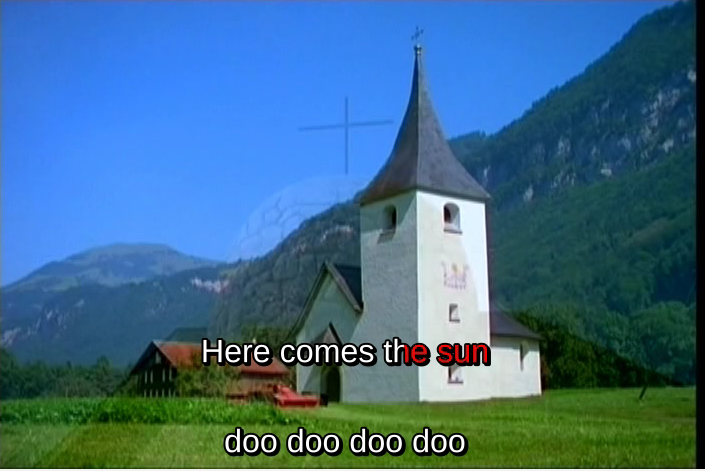

##  Multi-line Karaoke 


Ideally, a Karaoke system should have a "look ahead" mechanism whereby
you can see the next line before having to sing it. This can be done by
showing two lines of text with overlapping times at different heights.
The algorithm is:

```

	
When line N with markup is shown,
    show line N+1 without markup
After line N is finished, continue showing line N+1
When line N+1 is due to show,
     finish showing unmarked line N+1
     show line N+1 with markup
	
      
```


For the song Here Comes the Sun with lyrics

```

	
Here comes the sun
doo doo doo doo
Here comes the sun
I said it's alrigh
	
      
```


the resultant ASS file should look like

```

	
Dialogue: 0,0:00:18.22,0:00:19.94,Default,,0000,0000,0100,,{\kf16}Here {\kf46}comes {\kf43}the {\kf67}sun
Dialogue: 0,0:00:18.22,0:00:20.19,Default,,0000,0000,0000,,doo doo doo doo
Dialogue: 0,0:00:20.19,0:00:21.75,Default,,0000,0000,0000,,{\kf17}doo {\kf25}doo {\kf21}doo {\kf92}doo
Dialogue: 0,0:00:20.19,0:00:22.16,Default,,0000,0000,0100,,Here comes the sun
Dialogue: 0,0:00:22.16,0:00:24.20,Default,,0000,0000,0100,,{\kf17}Here {\kf46}comes {\kf43}the {\kf97}sun
Dialogue: 0,0:00:22.16,0:00:24.61,Default,,0000,0000,0000,,I said it's alright
	
      
```


with appearance



