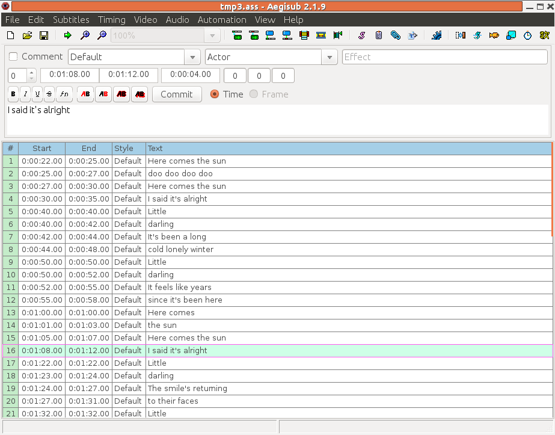

##  SubStation Alpha 


The SSA/ASS specification is at [
	MooDub.free
      ](http://moodub.free.fr/video/ass-specs.doc) It is brief and appears to contain some minor errors with respect
      to later specifications and implementations: for example, the time format
      is different. Or are the later ones all wrong?


SSA/ASS files can be used standalone. They can also be included
      in container formats such as Matroska files, discussed briefly
      in the [Codecs](../../Sampled/Codecs/) chapter. When they are embedded into  MKV files,
      some [
	restrictions 
      ](http://www.matroska.org/technical/specs/subtitles/ssa.html) are made, such as the text being converted
      into UTF-8 Unicode.


ASS files are divided into several sections:

+ General information about the environment the subtitle
	  file expects, such as the X and Y resolutions
+ Style information such as colours and fonts
+ Event information, which is where the subtitle text is
	  given along with timing information and 
	  any special effects to be applied


Under normal circumstances you would not directly create
      such files using a text editor. Instead, the program `Aegisub`gives you a GUI environment in which
      to create the files. Essentially, you just enter the text
      by lines, plus the start and end times for the line to 
      be displayed.


A screen dump is





Many special effects are possible. 
      The video on [
	Bill Cresswell's
      ](https://billcreswell.wordpress.com/tag/aegisub/) blog is an excellent example.
      Here is the direct [
	YouTube
      ](http://www.youtube.com/watch?v=0Z0dgdglrAo) link.


For completeness, here is part of an ASS file I created:

```

	
[Script Info]
; Script generated by Aegisub 2.1.9
; http://www.aegisub.org/
Title: Default Aegisub file
ScriptType: v4.00+
WrapStyle: 0
PlayResX: 640
PlayResY: 480
ScaledBorderAndShadow: yes
Video Aspect Ratio: 0
Video Zoom: 6
Video Position: 0

[V4+ Styles]
Format: Name, Fontname, Fontsize, PrimaryColour, SecondaryColour, OutlineColour, BackColour, Bold, Italic, Underline, StrikeOut, ScaleX, ScaleY, Spacing, Angle, BorderStyle, Outline, Shadow, Alignment, MarginL, MarginR, MarginV, Encoding
Style: Default,Arial,20,&H00FFFFFF,&H00B4FCFC,&H00000008,&H80000008,0,0,0,0,100,100,0,0,1,2,2,2,10,10,10,1

[Events]
Format: Layer, Start, End, Style, Name, MarginL, MarginR, MarginV, Effect, Text
Dialogue: 0,0:00:18.22,0:00:19.94,Default,,0000,0000,0000,,Here comes the sun
Dialogue: 0,0:00:20.19,0:00:21.75,Default,,0000,0000,0000,,doo doo doo doo
Dialogue: 0,0:00:22.16,0:00:24.20,Default,,0000,0000,0000,,Here comes the sun
Dialogue: 0,0:00:24.61,0:00:28.24,Default,,0000,0000,0000,,I said it's alright
...
	
      
```


