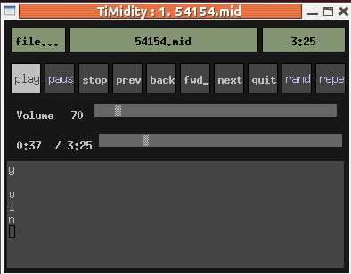

##  Introduction 


TiMidity is a MIDI player, not a Karaoke player.
By default it just plays the MIDI music, with the lyrics
printed out:

```
$timidity ../54154.mid
Requested buffer size 32768, fragment size 8192
ALSA pcm 'default' set buffer size 32768, period size 8192 bytes
Playing ../54154.mid
MIDI file: ../54154.mid
Format: 1  Tracks: 1  Divisions: 30
No instrument mapped to tone bank 0, program 92 - this instrument will not be heard
#0001
@@00@12
@Here Comes The Sun
@
@@Beatles
Here comes the sun
doo doo doo doo
Here comes the sun
I said it's alright
Little
darling
```


But it has
a number of alternative interfaces which give different displays.
If you run `timidity`with the `-h`(help)
option, it will show a screen including something like

```
Available interfaces (-i, --interface option):
  -in          ncurses interface
  -ie          Emacs interface (invoked from `M-x timidity')
  -ia          XAW interface
  -id          dumb interface
  -ir          remote interface
  -iA          ALSA sequencer interface
```


The default interface is "dumb", but if you run with, say, the XAW
interface you get a display like





There is, however, one unfortunate effect: the lyrics are displayed _before_ they are due to be played!
To get the lyrics played just as they should be sung,
you need to turn on the `--trace`option. From the man page,
"Toggles  trace  mode.   In trace mode, TiMidity++ attempts to
display its current state in real time."
You may find the link between documentation and behaviour
a lttle less than obvious...

```
timidity --trace ../54154.mid
```


This now works fine for MIDI files, the lyrics are displayed
when they should be sung. But it doesn't display the lyrics
for `.KAR`files. For that you need the `--trace-text-meta`option:

```
timidity --trace --trace-text-meta ../54154.kar
```


So by this stage, TiMidity will display the lyrics on the screen
in realtime for Karaoke files (and MIDI files with LYRIC events).
To have our own control over this display, we need to build our
own TiMidity interface.
