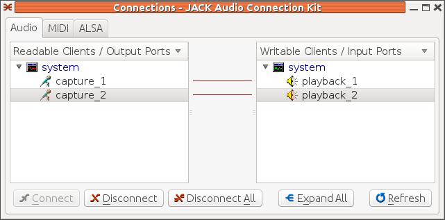
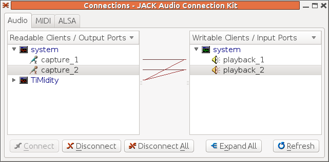

##  TiMidity and Jack 


In the MIDI chapter on [User space tools](../../MIDI/User/) we discussed playing MIDI files using Jack.
      Jack is designed to link audio sources and sinks in
      arbitrary configurations. By running `qjackctl`you can link, for example, microphone outputs to
      speaker inputs.
      This is done by dragging "capture_1" to "playback_1" etc
      and appears like





If TiMidity is then run with Jack output, you get instant
      Karaoke. You can also see the lyrics played in real time
      using the `--trace`option:

```

	
timidity -Oj --trace 54154.mid
	
      
```


The connections are shown in `qjackctl`as





The lyric display is klunky, and will be improved later.
