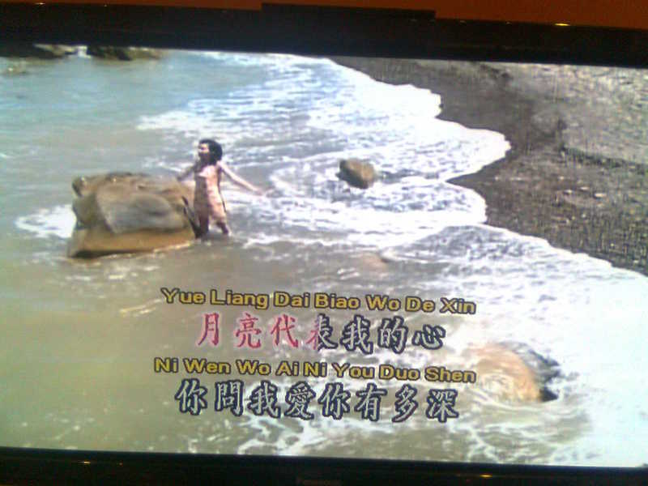
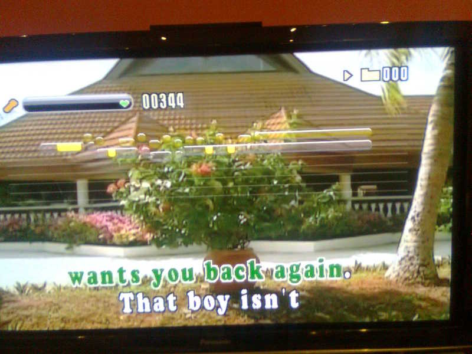

##  Karaoke machines 

> There are many Karaoke machines which come with a DVD, such as the Malata
or Songken systems. In most cases the songs are stored as MIDI files,
with the songtrack in one MIDI file and the lyrics in another. Some more
recent systems will use WMA files for the soundtrack, and this allows one
track to have a vocal supplied and the other without the vocal.
Such systems will usually include a scoring mechanism, although the
basis for the scoring is not made explicit.
The most recent ones are hard-disk based, usually with MP4 files.
They do not seem to have a scoring system.

> The two systems I own show different characteristics. The Songken MD-388
plays songs from multiple languages, such as Chinese, Korean, English, etc.
My wife is Chinese, but I cannot read Chinese characters. There is an
Anglicised script called _PinYin_ and the Songken shows both
the Chinese characters and the PinYin, so I can sing along too. It looks
like

> The Malata MDVD-6619 does not show the PinYin when playing Chinese songs.
But it does show the notes you are supposed to be singing and the notes you
are actually singing. This screen image shows that I am way off key:

