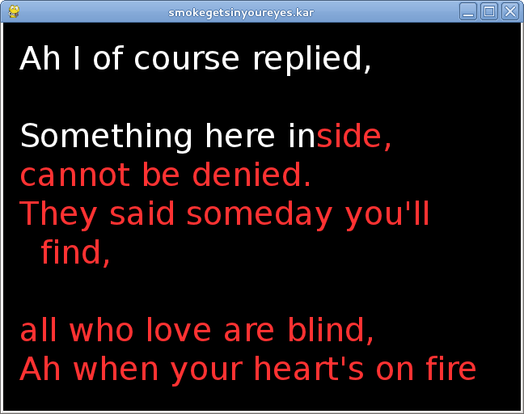
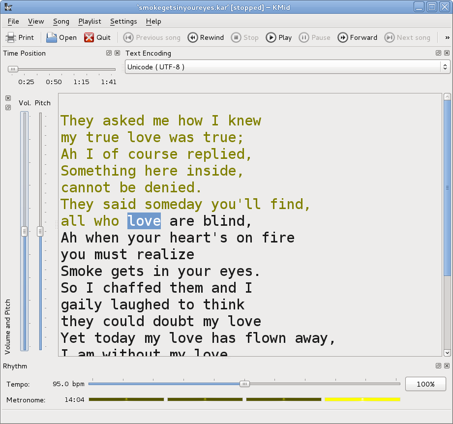

##  MP3+G files 


MP3+G files are CD+G files adapted for use on a normal
      PC. They consist of an MP3 file containing the audio
      and a CDG file containing the lyrics. Frequently they
      are zipp'ed together.


Many sites selling CD+G files also sell MP3+G files.
      Various web sites give instructions on how to create
      your own MP3+G files. There are not many free sites.


The program `cgdrip.py`from [
        cdgtools-0.3.2
      ](http://www.kibosh.org/cdgtools/) can rip CD+G files from an audio disk and convert
      them to a pair of MP3+G files.
      The instructions from the (Python) source code are


   > To start using cdgrip immediately, try the following from the 
        command-line (replacing the --device option by the path to your
        CD device):


```

          
 $ cdrdao read-cd --driver generic-mmc-raw --device /dev/cdroms/cdrom0 --read-subchan rw_raw mycd.toc
 $ python cdgrip.py --with-cddb --delete-bin-toc mycd.toc
          
        
```


   > 

> The MP3 and CDG files usually share the same root
      e.g. Track1.mp3 and Track1.cdg. When unzipped, `vlc`can play them by giving it the
      MP3 file _only_ to play as in

```

        
vlc Track1.mp3
        
      
```


> Other players such as mplayer do not recognise this
      combination and only play the audio.
Buying CD+G or MP3+G files

> There are many sites selling CD+G or MP3+G songs.
      Just do a Google search. However, the average price
      per song is about US$3, and if you want to build up a
      large collection that can become very expensive.
      Some sites will give discounts for larger volume purchases,
      but even at US$30 for 100 songs, the expense can be high.


> The cheapest site for _really_ large collections
      that I have found so far is [
        Unify mall
      ](http://www.unifymall.com) There you can purchase (for example) 29,000 English
      CDG songs for US$399. There is a little hiccup in this:
      if you buy their "UNIFY PCKP1000A 500-2000GB 
      HDD MP4/DVD/CDG PC Karaoke Player" for US$559 you should 
      be able to get these English songs for free! If you want
      to also get, say, 30,000 Mandarin songs thrown in for free, 
      the economics
      of building your own Karaoke player become more shaky...
      We will ignore that issue here - it's your choice!
Converting MP3+G to video files

> The tool `ffmpeg`can merge the audio and
      video to a single video file by e.g.

```

        
ffmpeg -i Track1.cdg -i Track1.mp3 -y Track1.avi
        
      
```


> or

```

        
avconv -i Track1.cdg -i Track1.mp3 test.avi
avconv -i test.avi -c:v libx264 -c:a copy outputfile.mp4
        
      
```


> to create an AVI file containing both video and audio.
      This can be played by vlc, mplayer, rhythmbox, etc.


> There is a program [
        cdg2video](http://code.google.com/p/cdg2video/) .
      While it is last dated February, 2011, changes in the FFMpeg
      internals means that it no longer compiles. Even if you fix
      the obvious changes, there are a huge number of complaints
      from the C compiler about the use of deprecated FFMpeg
      functions.
MPEG 4 files

> It is becoming common to have Karaoke systems using MPEG 4 video players.
      These embed all of the information into a video. There is no scoring
      system with players of these files.


> Some rate them as much higher sound quality: [      
	"MIDI files sound so cheesy it's sick"
      ](http://boards.straightdope.com/sdmb/showthread.php?t=83441) .
      I would suggest it is more an issue with the synthesizer used than the
      format. Certainly high-end synthesizer manufacturers such as Yamaha would not
      agree!


> MPEG 4 files are certainly larger than the corrsponding MIDI files,
      and you will need a substantial disk to hold many of them.


> There are many sites selling MP4 songs.
      Just do a Google search. However, the average price
      per song is about US$3, and if you want to build up a
      large collection that can become very expensive.
      Some sites will give discounts for larger volume purchases,
      but even at US$30 for 100 songs, the expense can be high.


> The cheapest site for _really_ large collections
      that I have found so far is [
        Unify mall
      ](http://www.unifymall.com) There you can purchase (for example) 6,200 English
      MP4 songs for US$199. There is a little hiccup in this:
      if you buy their "UNIFY PCKP1000A 500-2000GB 
      HDD MP4/DVD/CDG PC Karaoke Player" for US$559 you should 
      be able to get these English songs for free! If you want
      to also get, say, 25,000 Mandarin songs thrown in for free, 
      the economics
      of building your own Karaoke player become more shaky.
      We will ignore that issue here - it's your choice!
Karaoke machines

> There are many Karaoke machines which come with a DVD, such as the Malata
      or Songken systems. In most cases the songs are stored as MIDI files,
      with the songtrack in one MIDI file and the lyrics in another. Some more
      recent systems will use WMA files for the soundtrack, and this allows one
      track to have a vocal supplied and the other without the vocal.
      Such systems will usually include a scoring mechanism, although the
      basis for the scoring is not made explicit.
      The most recent ones are hard-disk based, usually with MP4 files.
      They do not seem to have a scoring system.


> The two systems I own show different characteristics. The Songken MD-388
      plays songs from multiple languages, such as Chinese, Korean, English, etc.
      My wife is Chinese, but I cannot read Chinese characters. There is an
      Anglicised script called _PinYin_ and the Songken shows both
      the Chinese characters and the PinYin, so I can sing along too. It looks
      like


> The Malata MDVD-6619 does not show the PinYin when playing Chinese songs.
      But it does show the notes you are supposed to be singing and the notes you
      are actually singing. This screen image shows that I am way off key:


MIDI players

> Karaoke files in MIDI format can be found from several sites, usually
      ending in .kar.
      Any MIDI player such as Timidity can play such files.
      However, they do not always show the lyrics synchronised to the melody.
Finding MIDI files

> There are several sites on the Web offering files in MIDI format.

> +  [ MIDIZone](http://www.free-midi.org) 
> +  [ midiworld ](http://www.midiworld.com) 
> +  [ CoolMIDI](http://www.cool-midi.com/) 
> +  [ ElectroFresh ](http://electrofresh.com/) 
> +  [ Freemidi ](http://freemidi.org/) 
> +  [ Karaoke Version ](http://www.karaoke-version.com) e.g. "House of the Rising Sun" melody on track 4
> +  [ MIDaoke ](http://www.midaoke.com/) e.g. Pink Floyd "Wish you were here" melody on track 2
> +  [ Home Musician ](http://karaoke.homemusician.net/) e.g. the Eages "Hotel California" has melody labelled "Melody"
	  on Clarinet on
	  track 4. kmid plays through lyrics.
	  e.g. Jimi Hendrix "Purple Haze" with melody labelled "Vocals - Choir Ahhs"
	  on track 4.
	  e.g. The Polics "Don't stand so close to me" melody on track 4
> +  [ 1001 Midis ](http://1001midis.com/) e.g. 10cc "I'm not in love" has melody on track 4, no lyrics
	  (MIDI only)KAR file format

> There is no formal standard for Karaoke MIDI files.
      There is a widely accepted industry format called
      the MIDI Karaoke Type 1 file format.


> From [
	MIDI Karaoke Frequently Asked Questions
      ](http://gnese.free.fr/Projects/KaraokeTime/Fichiers/karfaq.html) 


   > 

> > What is the MIDI Karaoke Type 1 (.KAR) file format? A:
	  A MIDI Karaoke file is a Standard MIDI File type 1 that 
	  contains a separate track with lyrics of the song entered 
	  as text events. Load one of the MIDI karaoke files into a
	  sequencer to examine the contents of the tracks of the file. 
	  The first track contains text events that are used to make the 
	  file recognizable as the MIDI Karaoke file. @KMIDI KARAOKE 
	  FILE text event is used to for that purpose. The optional text
	  event @V0100 denotes the format version number. Anything 
	  starting with @I is any information you want to include in the file.


> > The second track contains the text meta events for the 
	  lyrics of the song. The first event is @LENGL. It 
	  identifies the language of the song, in this case English. 
	  The next couple of events start with @T which identifies 
	  the title of the songs. You can have up to three events like 
	  these. The first event should contain the title of the song. 
	  Some programs (ex. Soft Karaoke) read this event to get the
	  name of the song to be displayed in the File Open dialog box.
	  The second event usually contains the performer or author 
	  of the song. The third event can contain any copyright 
	  information or anything else.


> > The rest of the second track contains the words of the song.
	  Each event is the syllable that is supposed to be sung at the 
	  time of the event. If the text starts with \, it means to 
	  clear the screen and show the words at the top of the screen. 
	  If the text starts with /, it means to go to the next line.


> > Important note: There can be only 3 lines per screen 
	  in a .kar file for Soft Karaoke being able to play the file
	  correctly. In other words, there can be only two / (forward 
	  slashes) beginning each line in a line of lyrics.
	  The next line has to start with \ (back slash).


> There are several weaknesses in this format:

> + The list of possible languages is not specified,
	  only English
> + The encoding of text is not specified (e.g. Unicode UTF-8?))
> + There is no means of identifying the channel carrying
	  the melodypykaraoke

> This is a dedicated Karaoke player written in Python, using a variety of
      libraries such as Pygame and WxPython.  It plays the song
      and shows where in the lyrics you are. A screen dump of [
	"Smoke gets in your eyes"](http://www.midikaraoke.com/cgi-bin/songdir/jump.cgi?ID=1280) looks like





> PyKaraoke plays the soundtrack and displays the lyrics. It does not act as a
      proper Karaoke system by also playing the singer's input. But PyKaraoke
      uses the PulseAudio system, so you can simultaneously play other programs.
      In particular, you can have PyKaraoke running in one window, while `pa-mic-2-speaker`is running in another. PulseAudio
      will mix the two output streams and play both sources together.
      Of course, there will no scoring possible in such a system without
      extra work.
kmid

>  ` kmid `is a KDE-based Karaoke player. It plays the song
      and shows where in the lyrics you are. A screen dump of "Smoke gets in your
      eyes" looks like





kmid uses either Timidity or Fluidsynth as MIDI backend.


>  `kmid`plays the soundtrack and displays the lyrics. It does not act as a
      proper Karaoke system by also playing the singer's input. But `kmid`can use the PulseAudio system, so you can simultaneously play other programs.
      In particular, you can have `kmid`running in one window, while `pa-mic-2-speaker`is running in another. PulseAudio
      will mix the two output streams and play both sources together.
      Of course, there will no scoring possible in such a system without
      extra work.
Microphone inputs and reverb effects

> Nearly all PCs and laptops have a soundcard to play audio. While nearly all
      of these also have a microphone input, some do not. For example, my Dell laptop
      does not; the Raspberry Pi does not; and many Android TV media boxes do not.


> Those computers without microphone inputs often have USB ports. They will usually
      accept USB soundcards, and if the USB has a microphone input then that is recognised.


> If you want to support two or more microphones, then you will need the corresponding
      number of soundcards, or a mixer device. I have seen the Behringer 
       MX-400 MicroMix, a  "Four Channel Compact Low Noise Mixer" for US$20,
      or you can find circuit diagrams on electronics web sites (Google for 
      "circuit diagram for audio mixer").


> Reverb is an effect which gives a fuller "body" to the voice by adding
      (artificial) echoes with different delays. Behringer also make the 
      MIX800 MiniMix which can mix two microphones with reverb effects and
      also has a passthrough for line input (so you can play the music and control
      the microphones). (I have no links to Behringer.).
      A similar unit is the UNIFY K9 Reverb Computer Karaoke Mixer.


> 


> DVD players from China often have dual microphone inputs with mix and reverb
      capabilities. Given that they can cost as little as US$13 (admittedly for 1,000
      units :-), it shows that mixing and reverb should not be too costly.
      My guess is that they use something like the [
	Mitsubishi M65845AFP
      ](http://www.datasheetcatalog.org/datasheet/MitsubishiElectricCorporation/mXuuvys.pdf) , "DIGITAL ECHO WITH MICROPHONE MIXING CIRCUIT".
      The data sheet shows a number of possible configurations, for those who like to
      build their own.
Conclusion

> There are a variety of Karaoke systems, using VCD disks or dedicated systems.
      MIDI format Karaoke files files can be played using ordinary MIDI software, and there are a 
      couple of Linux Karaoke players.


> Copyright © Jan Newmarch, jan@newmarch.name


"Programming and Using Linux Sound - in depth"by [Jan Newmarch](https://jan.newmarch.name) is licensed under a [Creative Commons Attribution-ShareAlike 4.0 International License](http://creativecommons.org/licenses/by-sa/4.0/) .


Based on a work at [https://jan.newmarch.name/LinuxSound/](https://jan.newmarch.name/LinuxSound/) .


> If you like this book, please contribute using Flattr


or donate using PayPal


