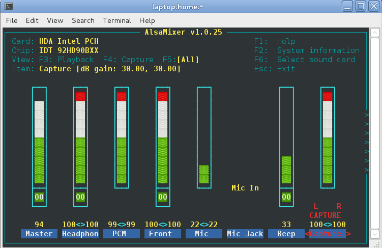

##  User space tools 

###  alsamixer 


 `alsamixer`runs within a terminal window and allows
you to select sound cards and controls interfaces on those cards.
It looks like


 `amixer`is a command line applications with similar functions.


Compared to the general mixer functions described in [the Basic chapter](../Basic/) , the mixer functions are quite limited:

+ Setting the playback and capture volumes on output and input channels
+ Muting or unmuting a card

The document [Sound configuration on Raspberry Pi with ALSA](http://blog.scphillips.com/2013/01/sound-configuration-on-raspberry-pi-with-alsa/) by Stephen C Phillips
is applicable
to all other ALSA systems and not just the Raspberry Pi.

###  alsactl 


Simple control programs for ALSA configurations.

###  speaker-test 


This command allows you to test which outputs go where.
For e.g. 5 channel sound, running

```

	
speaker-test -t wav -c 5
	
      
```


will produce on my default sound card the text and audio of

```

	
speaker-test 1.0.25

Playback device is default
Stream parameters are 48000Hz, S16_LE, 5 channels
WAV file(s)
Rate set to 48000Hz (requested 48000Hz)
Buffer size range from 39 to 419430
Period size range from 12 to 139810
Using max buffer size 419428
Periods = 4
was set period_size = 104857
was set buffer_size = 419428
 0 - Front Left
 1 - Front Right
 2 - Rear Left
 3 - Rear Right
 4 - Center
Time per period = 12.948378
	
      
```


It will also play the phrases "Front Left" etc to the relevant spekaer.

###  aplay/arecord 


Play a file or record to a file. To play the microphone to the speaker,

```

	
arecord -r 44100 --buffer-size=128 | aplay --buffer-size=128
	
      
```


or to record it to file

```


	arecord -f dat -d 20 -D hw:0,0 test.wav


```


will record a 20-second WAV file at DAT quality on your first available soundcard (hw:0,0). DAT quality is defined as stereo digital audio recorded with a 48 kHz samping rate and 16-bit resolution.

###  Identifying ALSA cards 


The simplest ways are to run `aplay`and `arecord`with the '-l' option:

+  `arecord -l`
```

	    
**** List of CAPTURE Hardware Devices ****
card 0: PCH [HDA Intel PCH], device 0: STAC92xx Analog [STAC92xx Analog]
  Subdevices: 1/1
  Subdevice #0: subdevice #0
card 2: Pro [SB X-Fi Surround 5.1 Pro], device 0: USB Audio [USB Audio]
  Subdevices: 1/1
  Subdevice #0: subdevice #0
	    
	  
```

+  `aplay -l`
```

	    
**** List of PLAYBACK Hardware Devices ****
card 0: PCH [HDA Intel PCH], device 0: STAC92xx Analog [STAC92xx Analog]
  Subdevices: 1/1
  Subdevice #0: subdevice #0
card 1: NVidia [HDA NVidia], device 3: HDMI 0 [HDMI 0]
  Subdevices: 1/1
  Subdevice #0: subdevice #0
card 1: NVidia [HDA NVidia], device 7: HDMI 1 [HDMI 1]
  Subdevices: 1/1
  Subdevice #0: subdevice #0
card 1: NVidia [HDA NVidia], device 8: HDMI 2 [HDMI 2]
  Subdevices: 1/1
  Subdevice #0: subdevice #0
card 2: Pro [SB X-Fi Surround 5.1 Pro], device 0: USB Audio [USB Audio]
  Subdevices: 1/1
  Subdevice #0: subdevice #0
card 2: Pro [SB X-Fi Surround 5.1 Pro], device 1: USB Audio [USB Audio #1]
  Subdevices: 1/1
  Subdevice #0: subdevice #0
	    
	  
```


###  Device names 


The cards are often given names such as "hw:0" or "hw:2.2"
in programs such as `qjackctl`(see the chapter on Jack).
The term "hw" refers to hardware devices. The major number refers to the
card number, the minor number to the device number.
The _name_ of the device is in [...] brackets.


Devices may also be known by _aliases_ .
The command `aplay -L`lists _device aliases_ .
For example, the "hdmi" alias is defined on my system in
the configuration file ` /etc/asound.conf`

```

	
pcm.hdmi0 {
        type hw
        card 1
        device 3 }

pcm.hdmi1 {
        type hw
        card 1
        device 7 }

pcm.hdmi2 {
        type hw
        card 1
        device 8 }
	
      
```


so that "hdmi:0" is really "hw:1,3": card 1, device 3.


Other aliases may be defined to cover a range of devices, parameterised by
card and device. For example, `/usr/share/alsa/pcm/surround40.conf`defines

```

	
pcm.!surround40 {
        @args [ CARD DEV ]
        @args.CARD {
                type string
                default {
                        @func getenv
                        vars [
                                ALSA_SURROUND40_CARD
                                ALSA_PCM_CARD
                                ALSA_CARD
                        ]
                        default {
                                @func refer
                                name defaults.pcm.surround40.card
                        }
                }
        }
        @args.DEV {
                type integer
                default {
                        @func igetenv
                        vars [
                                ALSA_SURROUND40_DEVICE
                        ]
                        default {
                                @func refer
                                name defaults.pcm.surround40.device
                        }
                }
        }
        ...
}
	
      
```


This defines for example "surround40:CARD=PCH,DEV=0" as an alias for hw:0,0
on my system (PCH is card 0).


I don't know an easy programmatic way to go from "card 1, device 3" to "hdmi:0".


The set of aliases can be shown using `aplay`and `arecord`:

+ The output from `aplay -L`on my system is
```

	
default
    Default
sysdefault:CARD=PCH
    HDA Intel PCH, STAC92xx Analog
    Default Audio Device
front:CARD=PCH,DEV=0
    HDA Intel PCH, STAC92xx Analog
    Front speakers
surround40:CARD=PCH,DEV=0
    HDA Intel PCH, STAC92xx Analog
    4.0 Surround output to Front and Rear speakers
surround41:CARD=PCH,DEV=0
    HDA Intel PCH, STAC92xx Analog
    4.1 Surround output to Front, Rear and Subwoofer speakers
surround50:CARD=PCH,DEV=0
    HDA Intel PCH, STAC92xx Analog
    5.0 Surround output to Front, Center and Rear speakers
surround51:CARD=PCH,DEV=0
    HDA Intel PCH, STAC92xx Analog
    5.1 Surround output to Front, Center, Rear and Subwoofer speakers
surround71:CARD=PCH,DEV=0
    HDA Intel PCH, STAC92xx Analog
    7.1 Surround output to Front, Center, Side, Rear and Woofer speakers
hdmi:CARD=NVidia,DEV=0
    HDA NVidia, HDMI 0
    HDMI Audio Output
hdmi:CARD=NVidia,DEV=1
    HDA NVidia, HDMI 1
    HDMI Audio Output
hdmi:CARD=NVidia,DEV=2
    HDA NVidia, HDMI 2
    HDMI Audio Output
sysdefault:CARD=Pro
    SB X-Fi Surround 5.1 Pro, USB Audio
    Default Audio Device
front:CARD=Pro,DEV=0
    SB X-Fi Surround 5.1 Pro, USB Audio
    Front speakers
surround40:CARD=Pro,DEV=0
    SB X-Fi Surround 5.1 Pro, USB Audio
    4.0 Surround output to Front and Rear speakers
surround41:CARD=Pro,DEV=0
    SB X-Fi Surround 5.1 Pro, USB Audio
    4.1 Surround output to Front, Rear and Subwoofer speakers
surround50:CARD=Pro,DEV=0
    SB X-Fi Surround 5.1 Pro, USB Audio
    5.0 Surround output to Front, Center and Rear speakers
surround51:CARD=Pro,DEV=0
    SB X-Fi Surround 5.1 Pro, USB Audio
    5.1 Surround output to Front, Center, Rear and Subwoofer speakers
surround71:CARD=Pro,DEV=0
    SB X-Fi Surround 5.1 Pro, USB Audio
    7.1 Surround output to Front, Center, Side, Rear and Woofer speakers
iec958:CARD=Pro,DEV=0
    SB X-Fi Surround 5.1 Pro, USB Audio
    IEC958 (S/PDIF) Digital Audio Output
	
      
```

+ The output from `arecord -L`is
```

	    
default
    Default
sysdefault:CARD=PCH
    HDA Intel PCH, STAC92xx Analog
    Default Audio Device
front:CARD=PCH,DEV=0
    HDA Intel PCH, STAC92xx Analog
    Front speakers
surround40:CARD=PCH,DEV=0
    HDA Intel PCH, STAC92xx Analog
    4.0 Surround output to Front and Rear speakers
surround41:CARD=PCH,DEV=0
    HDA Intel PCH, STAC92xx Analog
    4.1 Surround output to Front, Rear and Subwoofer speakers
surround50:CARD=PCH,DEV=0
    HDA Intel PCH, STAC92xx Analog
    5.0 Surround output to Front, Center and Rear speakers
surround51:CARD=PCH,DEV=0
    HDA Intel PCH, STAC92xx Analog
    5.1 Surround output to Front, Center, Rear and Subwoofer speakers
surround71:CARD=PCH,DEV=0
    HDA Intel PCH, STAC92xx Analog
    7.1 Surround output to Front, Center, Side, Rear and Woofer speakers
sysdefault:CARD=Pro
    SB X-Fi Surround 5.1 Pro, USB Audio
    Default Audio Device
front:CARD=Pro,DEV=0
    SB X-Fi Surround 5.1 Pro, USB Audio
    Front speakers
surround40:CARD=Pro,DEV=0
    SB X-Fi Surround 5.1 Pro, USB Audio
    4.0 Surround output to Front and Rear speakers
surround41:CARD=Pro,DEV=0
    SB X-Fi Surround 5.1 Pro, USB Audio
    4.1 Surround output to Front, Rear and Subwoofer speakers
surround50:CARD=Pro,DEV=0
    SB X-Fi Surround 5.1 Pro, USB Audio
    5.0 Surround output to Front, Center and Rear speakers
surround51:CARD=Pro,DEV=0
    SB X-Fi Surround 5.1 Pro, USB Audio
    5.1 Surround output to Front, Center, Rear and Subwoofer speakers
surround71:CARD=Pro,DEV=0
    SB X-Fi Surround 5.1 Pro, USB Audio
    7.1 Surround output to Front, Center, Side, Rear and Woofer speakers
iec958:CARD=Pro,DEV=0
    SB X-Fi Surround 5.1 Pro, USB Audio
    IEC958 (S/PDIF) Digital Audio Output
	    
	  
```


###  ALSA configuration files 


This tutorial by Volker Schatz explains what is going on in ALSA
configuration files and looks really good: [A close look at ALSA](http://www.volkerschatz.com/noise/alsa.html) 


We just note one thing: the default ALSA device is "hw:0". This is
hard-coded into ALSA. But it can be overridden in configuration files.
This is done for example by PulseAudio - see next chapter.

###  alsa-info 


This will collect information about your system and save it in a file.
It is a shell script that gives an enormous amount of information.
Here is a heavily elided subset of the information:

```

	
upload=true&script=true&cardinfo=
!!################################
!!ALSA Information Script v 0.4.60
!!################################

!!Script ran on: Tue Jun 12 04:50:22 UTC 2012


!!Linux Distribution
!!------------------

Fedora release 16 (Verne) Fedora release 16 (Verne) Fedora release 16 (Verne) Fedora release 16 (Verne)

...

!!ALSA Version
!!------------

Driver version:     1.0.24
Library version:    1.0.25
Utilities version:  1.0.25


!!Loaded ALSA modules
!!-------------------

snd_hda_intel
snd_hda_intel


!!Sound Servers on this system
!!----------------------------

Pulseaudio:
      Installed - Yes (/usr/bin/pulseaudio)
      Running - Yes

Jack:
      Installed - Yes (/usr/bin/jackd)
      Running - No


!!Soundcards recognised by ALSA
!!-----------------------------

 0 [PCH            ]: HDA-Intel - HDA Intel PCH
                      HDA Intel PCH at 0xe6e60000 irq 47
 1 [NVidia         ]: HDA-Intel - HDA NVidia
                      HDA NVidia at 0xe5080000 irq 17


!!PCI Soundcards installed in the system
!!--------------------------------------

00:1b.0 Audio device: Intel Corporation 6 Series/C200 Series Chipset Family High Definition Audio Controller (rev 04)
01:00.1 Audio device: nVidia Corporation HDMI Audio stub (rev a1)


...

!!HDA-Intel Codec information
!!---------------------------

...

Default PCM:
    rates [0x5e0]: 44100 48000 88200 96000 192000
    bits [0xe]: 16 20 24
    formats [0x1]: PCM

Node 0x0a [Pin Complex] wcaps 0x400583: Stereo Amp-In
  Control: name="Mic Jack Mode", index=0, device=0
    ControlAmp: chs=0, dir=In, idx=0, ofs=0
  Control: name="Mic Capture Volume", index=0, device=0
    ControlAmp: chs=3, dir=In, idx=0, ofs=0
  Control: name="Mic Jack", index=0, device=0
  Amp-In caps: N/A
  Amp-In vals:  [0x01 0x01]
  Pincap 0x0001173c: IN OUT HP EAPD Detect
    Vref caps: HIZ 50 GRD 80
  EAPD 0x2: EAPD
  Pin Default 0x03a11020: [Jack] Mic at Ext Left
    Conn = 1/8, Color = Black
    DefAssociation = 0x2, Sequence = 0x0
  Pin-ctls: 0x24: IN VREF_80
  Unsolicited: tag=03, enabled=1
  Power: setting=D0, actual=D0
  Connection: 3
     0x13* 0x14 0x1c


!!ALSA configuration files
!!------------------------

!!System wide config file (/etc/asound.conf)

#
# Place your global alsa-lib configuration here...
#

@hooks [
	{
		func load
		files [
			"/etc/alsa/pulse-default.conf"
		]
		errors false
	}
]

pcm.hdmi0 {
        type hw
        card 1
        device 3 }

pcm.hdmi1 {
        type hw
        card 1
        device 7 }

pcm.hdmi2 {
        type hw
        card 1
        device 8 }


!!Aplay/Arecord output
!!------------

APLAY

**** List of PLAYBACK Hardware Devices ****
card 0: PCH [HDA Intel PCH], device 0: STAC92xx Analog [STAC92xx Analog]
  Subdevices: 1/1
  Subdevice #0: subdevice #0
card 1: NVidia [HDA NVidia], device 3: HDMI 0 [HDMI 0]
  Subdevices: 1/1
  Subdevice #0: subdevice #0
card 1: NVidia [HDA NVidia], device 7: HDMI 1 [HDMI 1]
  Subdevices: 1/1
  Subdevice #0: subdevice #0
card 1: NVidia [HDA NVidia], device 8: HDMI 2 [HDMI 2]
  Subdevices: 1/1
  Subdevice #0: subdevice #0

ARECORD

**** List of CAPTURE Hardware Devices ****
card 0: PCH [HDA Intel PCH], device 0: STAC92xx Analog [STAC92xx Analog]
  Subdevices: 1/1
  Subdevice #0: subdevice #0

!!Amixer output
!!-------------

!!-------Mixer controls for card 0 [PCH]

Card hw:0 'PCH'/'HDA Intel PCH at 0xe6e60000 irq 47'
  Mixer name	: 'IDT 92HD90BXX'
  Components	: 'HDA:111d76e7,10280494,00100102'
  Controls      : 19
  Simple ctrls  : 10
Simple mixer control 'Master',0
  Capabilities: pvolume pvolume-joined pswitch pswitch-joined penum
  Playback channels: Mono
  Limits: Playback 0 - 64
  Mono: Playback 62 [97%] [-1.50dB] [on]
Simple mixer control 'Headphone',0
  Capabilities: pvolume pswitch penum
  Playback channels: Front Left - Front Right
  Limits: Playback 0 - 64
  Mono:
  Front Left: Playback 64 [100%] [0.00dB] [on]
  Front Right: Playback 64 [100%] [0.00dB] [on]
Simple mixer control 'PCM',0
  Capabilities: pvolume penum
  Playback channels: Front Left - Front Right
  Limits: Playback 0 - 255
  Mono:
  Front Left: Playback 254 [100%] [0.20dB]
  Front Right: Playback 254 [100%] [0.20dB]
Simple mixer control 'Front',0
  Capabilities: pvolume pswitch penum
  Playback channels: Front Left - Front Right
  Limits: Playback 0 - 64
  Mono:
  Front Left: Playback 64 [100%] [0.00dB] [on]
  Front Right: Playback 64 [100%] [0.00dB] [on]
Simple mixer control 'Mic',0
  Capabilities: cvolume penum
  Capture channels: Front Left - Front Right
  Limits: Capture 0 - 3
  Front Left: Capture 1 [33%] [10.00dB]
  Front Right: Capture 1 [33%] [10.00dB]
Simple mixer control 'Mic Jack Mode',0
  Capabilities: enum
  Items: 'Mic In' 'Line In'
  Item0: 'Mic In'
Simple mixer control 'Beep',0
  Capabilities: pvolume pvolume-joined pswitch pswitch-joined penum
  Playback channels: Mono
  Limits: Playback 0 - 3
  Mono: Playback 1 [33%] [-12.00dB] [on]
Simple mixer control 'Capture',0
  Capabilities: cvolume cswitch penum
  Capture channels: Front Left - Front Right
  Limits: Capture 0 - 46
  Front Left: Capture 46 [100%] [30.00dB] [on]
  Front Right: Capture 46 [100%] [30.00dB] [on]
Simple mixer control 'Dock Mic',0
  Capabilities: cvolume penum
  Capture channels: Front Left - Front Right
  Limits: Capture 0 - 3
  Front Left: Capture 0 [0%] [0.00dB]
  Front Right: Capture 0 [0%] [0.00dB]
Simple mixer control 'Internal Mic',0
  Capabilities: cvolume penum
  Capture channels: Front Left - Front Right
  Limits: Capture 0 - 3
  Front Left: Capture 0 [0%] [0.00dB]
  Front Right: Capture 0 [0%] [0.00dB]

!!-------Mixer controls for card 1 [NVidia]

Card hw:1 'NVidia'/'HDA NVidia at 0xe5080000 irq 17'
  Mixer name	: 'Nvidia GPU 1c HDMI/DP'
  Components	: 'HDA:10de001c,10281494,00100100'
  Controls      : 18
  Simple ctrls  : 3
Simple mixer control 'IEC958',0
  Capabilities: pswitch pswitch-joined penum
  Playback channels: Mono
  Mono: Playback [on]
Simple mixer control 'IEC958',1
  Capabilities: pswitch pswitch-joined penum
  Playback channels: Mono
  Mono: Playback [off]
Simple mixer control 'IEC958',2
  Capabilities: pswitch pswitch-joined penum
  Playback channels: Mono
  Mono: Playback [off]


!!Alsactl output
!!-------------

--startcollapse--
state.PCH {
	control.1 {
		iface MIXER
		name 'Front Playback Volume'
		value.0 64
		value.1 64
		comment {
			access 'read write'
			type INTEGER
			count 2
			range '0 - 64'
			dbmin -4800
			dbmax 0
			dbvalue.0 0
			dbvalue.1 0
		}
	}
...
	
      
```


###  Applications using ALSA 


Many applications can directly use ALSA
by appropriate commandline arguments.

####  MPlayer 


To play a file to an ALSA device using `mplayer`,
use code such as

```

	
mplayer -ao alsa:device=hw=1.0 -srate 48000  bryan.mp3
	
      
```


####  VLC 


To play a file to an ALSA device using `vlc`,
use code such as

```

	
vlc --aout alsa ...
	
      
```


####  TiMidity 


To play a file to an ALSA device using `timidity`,
use code such as

```

	
timidity -Os ...
	
      
```


