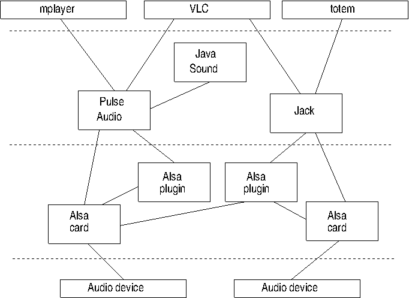

##  Components 

The following diagram indicates the different layers:

###  Device drivers 

At the bottom layer is the hardware itself, the audio device. These are the audio cards
      made by a variety of manufacturers, all with different capabilities, interfaces and prices.
      Just like any piece of hardware, in order for it to be visible and useful to the Operating
      System there must be a device driver. There are of courses thousands of device drivers
      written for Linux. Writing Linux device drivers is a speciality of itself, and there
      are dedicated sources for this, such as [
	Linux Device Drivers, Third Edition
      ](http://lwn.net/Kernel/LDD3/) by Jonathan Corbet, Alessandro Rubini, and Greg Kroah-Hartman.

Device drivers must have standardised APIs "at the top" so that users of the device have a
      known interface to code to. The OSS device driver API was used for audio devices until
      it was made closed source, at which point developers switched to the ALSA API.
      While OSS v4 has become open again, the ALSA interface is supported in the kernel
      while OSS is not.

Ideally, a device driver API should expose all of the features of hardware while not
      adding additional baggage. For audio, it is not always so easy to set boundaries for
      what an audio driver should do. For example, some sound cards will support mixing
      of analog signals from different sources, while others will not, and some sound cards
      will have MIDI synthesizers while others will not. If the API is to expose these
      capabilities for sound cards which support them, then it might have to supply them in software
      for those sound cards which do not.

There is a somewhat dated document on [
	writing ALSA device drivers
      ](http://www.alsa-project.org/~tiwai/writing-an-alsa-driver/) by Takashi Iwai

###  Sound servers 

Linux is a multi-tasking, multi-threaded operating system. It is possible that concurrent
      processes might wish to write sounds to the audio cards concurrently. For example,
      a mail reader might wish to "ding" the user to report new mail, 
      even if they are in the middle of a noisy
      computer game. This is distinct from sound card capabilities of being able to mix sounds
      from different ports, such as an HDMI input port and an analog input port. It requires the ability
      to mix (or otherwise manage) sounds from different processes. As an example of the subtlety
      of this, should the volume of each process be individually controllable, or should the
      destination port (headphones or speaker) be individually controllable?

Such capabilities are beyond the scope of a device driver. Linux resolves this by having
      "sound servers" which run above the device drivers and manage these more complex tasks.
      Above these will sit applications which talk to the sound server which in turn will
      pass the resultant digital signal to the device driver.

Here is where a significant difference occurs between sound servers. For professional audio
      systems the sound server must be able to process and route audio with the minimal amount
      of latency or other negative effects. For consumer audio, control over volumes and destinations
      may be more important than altency - you probably won't care if a new message "ding" takes an extra
      half-second. Between these may be other cases such as games requiring synchronisation of 
      audio and visual effects, and Karaoke players requiring synchronisation of analog and 
      digital sources.

The two major sound servers under Linux are Jack for professional audio and PulseAudio
      for consumer systems. They are designed for different use-cases and consequently offer
      different features.

Lennart Poettering in [
	A Guide Through The Linux Sound API Jungle
      ](http://0pointer.de/blog/projects/guide-to-sound-apis.html) offers a good summary of these different use cases:

   > 
> + __I want to write a media-player-like application!__:
Use GStreamer! (Unless your focus is only KDE in which cases Phonon might be an alternative.)
> + __I want to add event sounds to my application!__:
Use libcanberra, install your sound files according to the XDG Sound Theming/Naming Specifications! (Unless your focus is only KDE in which case KNotify might be an alternative although it has a different focus.)
> + __I want to do professional audio programming, hard-disk recording, music synthesizing, MIDI interfacing!__:
Use JACK and/or the full ALSA interface.
> + __I want to do basic PCM audio playback/capturing!__:
Use the safe ALSA subset.
> + __I want to add sound to my game!__:
Use the audio API of SDL for full-screen games, libcanberra for simple games with standard UIs such as Gtk+.
> + __I want to write a mixer application!__:
Use the layer you want to support directly: if you want to support enhanced desktop software mixers, use the PulseAudio volume control APIs. If you want to support hardware mixers, use the ALSA mixer APIs.
> + __I want to write audio software for the plumbing layer!__:
Use the full ALSA stack.
> + __I want to write audio software for embedded applications!__:
For technical appliances usually the safe ALSA subset is a good choice, this however depends highly on your use-case.

###  Complexities 

The simple diagram I drew above hides the real complexities of Linux sound.
      Mike Melanson (an Adobe engineer) in 2007 produced this diagram

The figure is not up-to-date: for example,
      OSS is no longer a major part of Linux.
      Some special-case complexities are, for example,
      that  PulseAudio sits above ALSA,
      and it also sits _below_ ALSA as in this figure from [
	insane coding
      ](http://insanecoding.blogspot.com.au/2009/06/state-of-sound-in-linux-not-so-sorry.html) :

(This diagram is upside-down compared to mine.)

The explanation is as follows:

+ PulseAudio is able to do things like mixing application sounds 
	  that ALSA cannot do
+ PulseAudio installs itself as the default ALSA output device
+ An application sends audio to the ALSA default device which sends
	  it to PulseAudio
+ PulseAudio mixes it it with any other audio and then sends it back
	  to a particular device in ALSA
+ ALSA then plays the mixed sound

Complex, yes, but is accomplishes tasks that wouild be difficult otherwise
.
