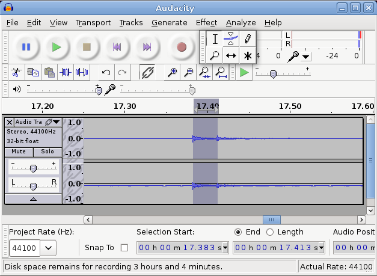

##  Latency 

Latency is the amount of time that elapses from when a signal
      enters a system to when it (or its equivalent such as an amplified version)
      leaves the system.

From Ian Waugh's [ 
	Fixing Audio Latency Part 1:
      ](http://www.practicalpc.co.uk/computing/sound/latency1.htm) 

   > 

> Latency is a delay. It's most evident and problematic in computer-based music audio 
	  systems where it manifests as the delay between triggering a signal and hearing it. 
	  For example, pressing a key on your MIDI keyboard and hearing the sound play 
	  through your sound card.

> It's like a delayed reaction and if the delay is very large it becomes impossible 
	  to play anything in time because the sound you hear is always a little bit behind 
	  what you're playing which is very distracting.

> This delay does not have to be very large before it causes problems. 
	  Many people can work with a latency of about 40ms even though the delay is noticeable, 
	  although if you are playing pyrotechnic music lines it may be too long.

> The ideal latency is 0 but many people would be hard pushed to notice delays of 
	  less than 8-10ms and many people can work quite happily with a 20ms latency.

A Google search for "measuring audio latency" will turn up many sites.
      I use a crude - but simple - test. I installed Audacity on a separate PC,
      and used it to record simultaneously a sound I made and that sound when 
      picked up and played back by the test PC. I banged a spoon against a bottle
      to get a sharp percursive sound. When magnified, the recorded sound showed 
      two peaks and selecting the region between the peaks showed me the latency
      in the selection start/end. In the figure below, these are
      17.383 and 17.413 seconds, with a latency of 30 msecs.

