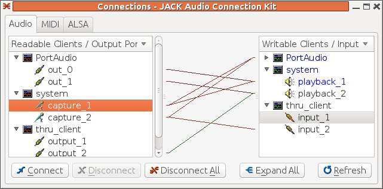

##  Audacity with Jack 

Audacity is Jack aware. You can use it to capture and display
Jack streams. But that doesn't mean that for the user it plays
in a _nice_ way! With a running Jack system, starting
Audacity registers it with Jack - but there are no input nor
output ports. These only show up when you start a record
session with Audacity. It then establishes its own links
within Jack.

For example, with `thru_client`as the only client
within Jack, `qjackctl`shows the connections

In this, the capture devices are connected to the `thru_client`inputs, and the `thru_client`outputs are connected to the playback outputs.

Just starting Audacity but not recording anything makes no
changes to this connection graph.

But when Audacity starts recording with `thru_client`already running, `qjackctl`shows the links established as in this figure:

This is a lot messier: Audacity shows as Port Audio devices
and the capture devices are linked to the Port Audio inputs
while the Port Audio outputs are linked to the playback
devices.
The existing `thru_client`links are basically
discarded.
To set up your desired situation,
these have to be relinked as needed.

To demonstrate the effects of delaying one channel, start
Jack, start `delay`and then start Audacity.
Relink the ports according to the following `qjackctl`figure:

That is, capture ports are linked to `delay`input ports, `delay`output ports are linked
to Port Audio (Audacity) input ports and Port Audio
output ports are linked to playback ports.

The waveforms captured by Audacity clearly show the delay
on the left channel compared to the right:

