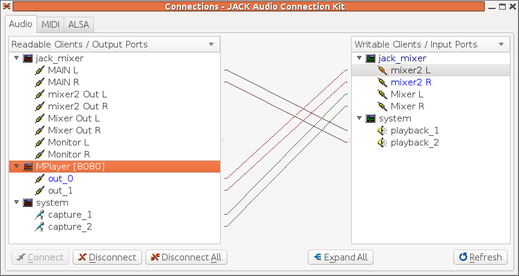

##  Mixing audio 


If two output ports from two different sources are connected to the same input port,
then Jack will mix them for you. This allows you to sing along to your favourite MP3 file
with no effort:

+ Connect the microphone capture ports to the playback ports - avoid setting up a feedback
loop between your laptop's microphone and speakers by e.g plugging in headphones
+ Start a player such as `mplayer`which will also connect to the
playback ports by e.g.
```

	    
mplayer -ao jack <MP3 file >
	    
	  
```

+ Start singing

Of course, there is no volume control on each source. You can insert a mixer such as [jack_mixer](http://home.gna.org/jackmixer/) (maybe in your distro too),
and then use that to control the volume of each source, as shown in this `qjackctl`screen:





