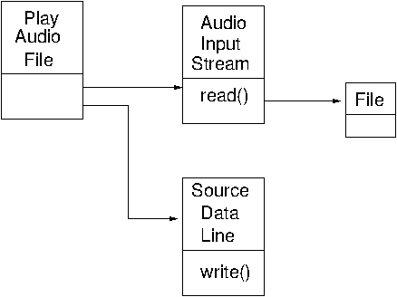

##  Playing audio from a file 


To play from a file, appropriate objects must be created for reading
      from the file and for writing to the output device. These are

+ An `AudioInputStream`is requested from the `AudioSystem`. It is created with the filename as
	  parameter.
+ A source data line is created for the output. The nomenclature
	  may be confusing: the program produces _output_ , but this
	  is _input_ to the dataline. So the dataline must be a source
	  for the output device. The creation of a dataline is a multi-step
	  process:
+ First create a `AudioFormat`object to specify
	      parameters for the dataline
+ Create a `DataLine.Info`for a source dataline with
	      the audion format
+ Request a source dataline from the `AudioSystem`which
	      will handle the `DataLine.Info`

Following these steps, data can then be read from the input stream and written
      to the dataline.
      The UML class diagram for the relevant classes is




```

      
      import java.io.File;
import java.io.IOException;
     
import javax.sound.sampled.AudioFormat;
import javax.sound.sampled.AudioInputStream;
import javax.sound.sampled.AudioSystem;
import javax.sound.sampled.DataLine;
import javax.sound.sampled.FloatControl;
import javax.sound.sampled.LineUnavailableException;
import javax.sound.sampled.SourceDataLine;
     
public class PlayAudioFile {
    /** Plays audio from given file names. */
    public static void main(String [] args) {
	// Check for given sound file names.
	if (args.length < 1) {
	    System.out.println("Usage: java Play <sound file names>*");
	    System.exit(0);
	}
     
	// Process arguments.
	for (int i = 0; i < args.length; i++)
	    playAudioFile(args[i]);
     
	// Must exit explicitly since audio creates non-daemon threads.
	System.exit(0);
    } // main
     
    public static void playAudioFile(String fileName) {
	File soundFile = new File(fileName);
     
	try {
	    // Create a stream from the given file.
	    // Throws IOException or UnsupportedAudioFileException
	    AudioInputStream audioInputStream = AudioSystem.getAudioInputStream(soundFile);
	    // AudioSystem.getAudioInputStream(inputStream); // alternate audio stream from inputstream
	    playAudioStream(audioInputStream);
	} catch (Exception e) {
	    System.out.println("Problem with file " + fileName + ":");
	    e.printStackTrace();
	}
    } // playAudioFile
     
    /** Plays audio from the given audio input stream. */
    public static void playAudioStream(AudioInputStream audioInputStream) {
	// Audio format provides information like sample rate, size, channels.
	AudioFormat audioFormat = audioInputStream.getFormat();
	System.out.println("Play input audio format=" + audioFormat);
     
	// Open a data line to play our type of sampled audio.
	// Use SourceDataLine for play and TargetDataLine for record.
	DataLine.Info info = new DataLine.Info(SourceDataLine.class, audioFormat);
	if (!AudioSystem.isLineSupported(info)) {
	    System.out.println("Play.playAudioStream does not handle this type of audio on this system.");
	    return;
	}
     
	try {
	    // Create a SourceDataLine for play back (throws LineUnavailableException).
	    SourceDataLine dataLine = (SourceDataLine) AudioSystem.getLine(info);
	    // System.out.println("SourceDataLine class=" + dataLine.getClass());
     
	    // The line acquires system resources (throws LineAvailableException).
	    dataLine.open(audioFormat);
     
	    // Adjust the volume on the output line.
	    if(dataLine.isControlSupported(FloatControl.Type.MASTER_GAIN)) {
		FloatControl volume = (FloatControl) dataLine.getControl(FloatControl.Type.MASTER_GAIN);
		volume.setValue(6.0F);
	    }
     
	    // Allows the line to move data in and out to a port.
	    dataLine.start();
     
	    // Create a buffer for moving data from the audio stream to the line.
	    int bufferSize = (int) audioFormat.getSampleRate() * audioFormat.getFrameSize();
	    byte [] buffer = new byte[ bufferSize ];
     
	    // Move the data until done or there is an error.
	    try {
		int bytesRead = 0;
		while (bytesRead >= 0) {
		    bytesRead = audioInputStream.read(buffer, 0, buffer.length);
		    if (bytesRead >= 0) {
			// System.out.println("Play.playAudioStream bytes read=" + bytesRead +
			// ", frame size=" + audioFormat.getFrameSize() + ", frames read=" + bytesRead / audioFormat.getFrameSize());
			// Odd sized sounds throw an exception if we don't write the same amount.
			int framesWritten = dataLine.write(buffer, 0, bytesRead);
		    }
		} // while
	    } catch (IOException e) {
		e.printStackTrace();
	    }
     
	    System.out.println("Play.playAudioStream draining line.");
	    // Continues data line I/O until its buffer is drained.
	    dataLine.drain();
     
	    System.out.println("Play.playAudioStream closing line.");
	    // Closes the data line, freeing any resources such as the audio device.
	    dataLine.close();
	} catch (LineUnavailableException e) {
	    e.printStackTrace();
	}
    } // playAudioStream
} // PlayAudioFile


      
    
```
