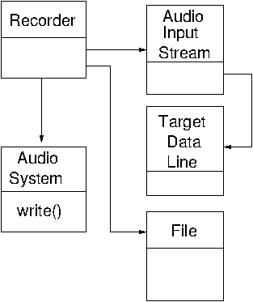

#  Recording audio to a file 

Most of the work to do this is in preparation of an audio input stream.
      Once that is done the method
 `write`of
 `AudioSystem`will copy input from the audio input stream to the output file.

To prepare the audio input stream:

+  Create an
 `AudioFormat`object describing the parameters
	  of the input


+  The microphone
produces
audio. So it needs a
 `TargetDataLine`.
	  So create a
 `DataLine.Info`for a target dataline.


+  Ask the
 `AudioSystem`for a line satisfying the information


+  Wrap the line in an
 `AudioInputStream`


The output is just a Java
 `File`.

Then use the
 `AudioSystem`function
 `write()`to copy the stream to the file.
      The UML class diagram is



The program is:
```


import javax.sound.sampled.*;
import java.io.File;

/**
 * Sample audio recorder
 */
public class Recorder extends Thread
{
    /**
     * The TargetDataLine that we’ll use to read data from
     */
    private TargetDataLine line;

    /**
     * The audio format type that we’ll encode the audio data with
     */
    private AudioFileFormat.Type targetType = AudioFileFormat.Type.WAVE;

    /**
     * The AudioInputStream that we’ll read the audio data from
     */
    private AudioInputStream inputStream;

    /**
     * The file that we’re going to write data out to
     */
    private File file;

    /**
     * Creates a new Audio Recorder
     */
    public Recorder(String outputFilename)
    {
	try {
	    // Create an AudioFormat that specifies how the recording will be performed
	    // In this example we’ll 44.1Khz, 16-bit, stereo
	    AudioFormat audioFormat = new AudioFormat(
						      AudioFormat.Encoding.PCM_SIGNED,    // Encoding technique
						      44100.0F,                           // Sample Rate
						      16,                                 // Number of bits in each channel
						      2,                                  // Number of channels (2=stereo)
						      4,                                  // Number of bytes in each frame
						      44100.0F,                            // Number of frames per second
						      false);                            // Big-endian (true) or little-
	    // endian (false)

	    // Create our TargetDataLine that will be used to read audio data by first 
	    // creating a DataLine instance for our audio format type
	    DataLine.Info info = new DataLine.Info(TargetDataLine.class, audioFormat);

	    // Next we ask the AudioSystem to retrieve a line that matches the 
	    // DataLine Info
	    this.line = (TargetDataLine)AudioSystem.getLine(info);

	    // Open the TargetDataLine with the specified format
	    this.line.open(audioFormat);

	    // Create an AudioInputStream that we can use to read from the line
	    this.inputStream = new AudioInputStream(this.line);

	    // Create the output file
	    this.file = new File(outputFilename);
	}
	catch(Exception e) {
	    e.printStackTrace();
	}
    }

    public void startRecording() {
        // Start the TargetDataLine
        this.line.start();

        // Start our thread
        start();
    }

    public void stopRecording() {
        // Stop and close the TargetDataLine
        this.line.stop();
        this.line.close();
    }

    public void run() {
        try {
	    // Ask the AudioSystem class to write audio data from the audio input stream
	    // to our file in the specified data type (PCM 44.1Khz, 16-bit, stereo)
	    AudioSystem.write(this.inputStream, this.targetType, this.file);
	}
        catch(Exception e) {
	    e.printStackTrace();
	}
    }

    public static void main(String[] args) {
        if (args.length == 0) {
	    System.out.println("Usage: Recorder <filename>");
	    System.exit(0);
	}

        try {
	    // Create a recorder that writes WAVE data to the specified filename
	    Recorder r = new Recorder(args[0]);
	    System.out.println("Press ENTER to start recording");
	    System.in.read();

	    // Start the recorder
	    r.startRecording();

	    System.out.println("Press ENTER to stop recording");
	    System.in.read();

	    // Stop the recorder
	    r.stopRecording();

	    System.out.println("Recording complete");
	}
        catch(Exception e) {
	    e.printStackTrace();
	}
    }

}
```


