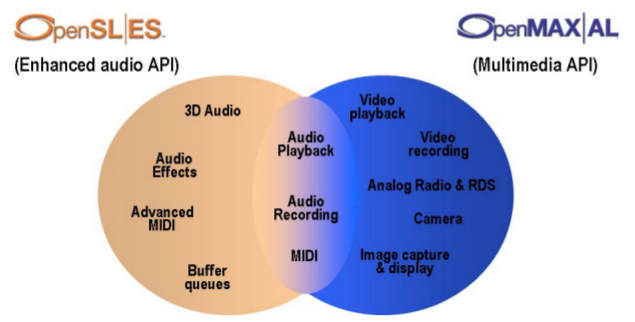

##  OpenMAX AL and OpenSL ES 

"The Khronos Group is a not for profit industry consortium creating open standards
for the authoring and acceleration of parallel computing, graphics, dynamic media,
computer vision and sensor processing on a wide variety of
platforms and devices". For this book, the relevant standards that they produce
are OpenSL (not to be confused with OpenGL - a graphics specification) and
OpenMAX.

OpenSL and OpenMAX are intended for slightly different uses, but have an overlap
of functionality. From the OpenSL ES and OpenMAX Al specifications this is shown by the
following figure:

OpenSL is intended for complex audio systems while OpenMAX is intended for
general multi-media systems. Either can be used separately, or if needed
both can be used - in the overlapping area the functionality is the same
(even though the function calls are distinct).

Each of these is further divided into _profiles_ . For OpenSL the
profiles are

+ Phone
+ Music
+ Game

with optional functionality in

+ Audio recording
+ Haptics
+ Macroscopic behavior in 3D audio

A full chart of features in each profile is given in the specification.

OpenMAX has profiles

+ Media playback
+ Media recording
+ Effects and controls

with optional functionality in

+ MIDI
+ Analog radio
+ LED array
+ Vibration device

A full chart of features in each profile is given in the specification.

Just to complicate things a little, OpenSL only has one specification,
OpenSL ES (no, I don't know what ES stands for). On the other hand,
OpenMAX has two specified layers, OpenMAX IL (interface layer)
and OpenMAX AL (application layer). The APIs for OpenSL ES and
OpenMAX AL mirror each other in the common area.
The API for OpenMAX IL is at a considerably lower level than the API
for OpenMAX AL, and is discussed in a later section.

The specifications give some examples on how the different profiles might be mixed:

   > 
> + Example 1: an audio-only application will have no need for video and image
functionality and therefore would likely pick one of the OpenSL ES profiles,
depending on the use cases of interest.
> + Example 2: a media playback and recording application would use the OpenMAX AL
1.0 Media Player/Recorder profile.
> + Example 3: An advanced multimedia/game application that needs
audio/video/image playback and recording as well as advanced audio features like
3D audio and effects would use both the Media Player/Recorder profile of OpenMAX
AL 1.0 and the Game profile of OpenSL ES 1.0.

