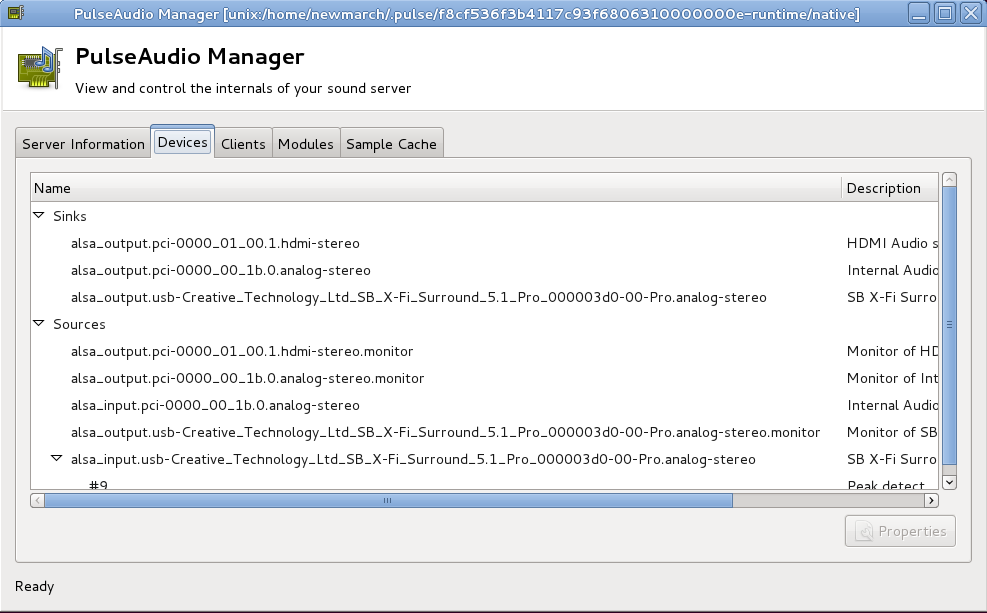
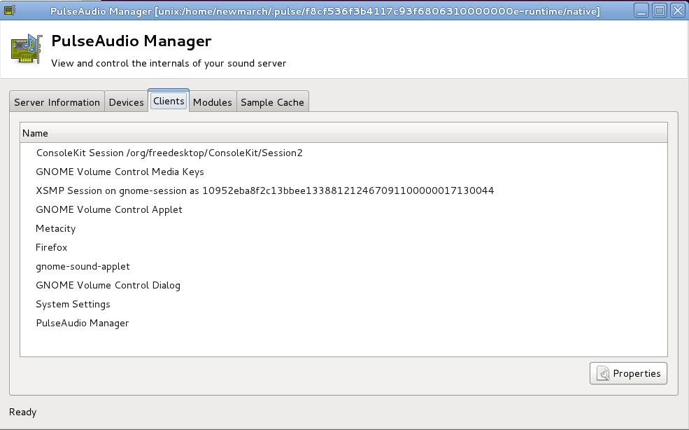
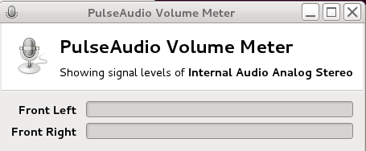
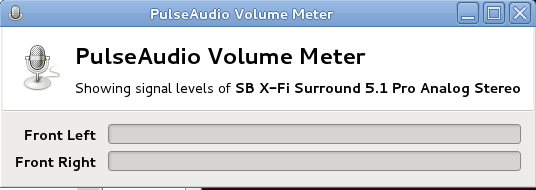
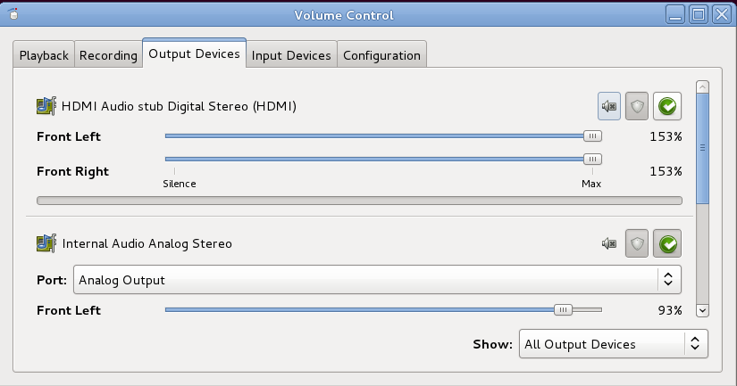
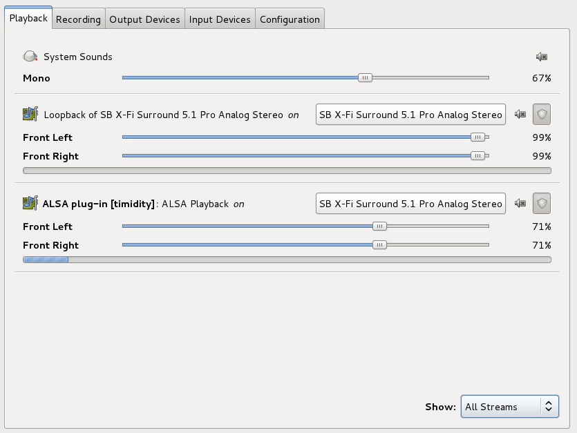
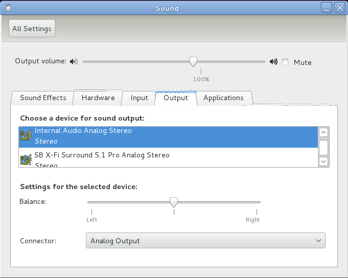

##  User space tools 

###  paman 


This shows you information about the PulseAudio server, its devices and clients.
      The following three screen dumps show the type of information it gives.







###  pavumeter 


 `pavumeter`is a simple meter for showing input or output levels
      of the default devices. When run by `pavumeter`it shows the
      playback device as in





while if it is run by `pavumeter --record`it shows the record device
      as in





###  pavucontrol


 `pavucontrol`allows you to control the input and ouput volumes of the
      different connected audio devices:





With these tabs, `pavucontrol`is a device-level mixer,
      able to control the overall volume to individual devices.


One of the special advantages of PulseAudio is that it can perform
      application-level mixing. If two audio sources write to the same 
      PulseAudio device, the audio will be mixed to the output device. `pavucontrol`can show the multiple applications using
      the Playback tab, showing all applications or all streams 
      currently being mixed. Each stream can have its channel volumes
      individually controlled.


For example, Karaoke on the cheap can be done by setting
      the straight-through module for the microphone to speaker
      by

```

	
pactl load-module module-loopback latency_msec=1
	
      
```


while the Karoake file is played by a Karaoke player
      such as `kmid`through `timidity`e.g.

```

	
kmid nightsin.kar
	
      
```


While these two are running, relative volumes can be controlled
      by use of `pavucontrol`:





###  Gnome control center (sound) 


The `gnome-control-center sound`allows full view and control of
       the attached sound devices, including selection of the default input and
      output devices. It looks like




###  parec/paplay/pacat 


These are command line tools to record and playback sound files.
      They are all symbolic links to the same code, just differently named links.
      The default format is PCM s16.
      There are many options, but they don't always do quite what you want them to.
      For example, to play from the default record device to the default playback
      device with minimum latency,

```

	
pacat -r --latency-msec=1 | pacat -p --latency-msec=1
	
      
```


This actually has a latency of about 50 msec.

###  pactl/pacmd 


These two commands do basically the same thing. ` pacmd `is
      the interactive version with more options.
      For example ` pacmd `with the command ` list-sinks `includes

```

	
	name: <alsa_output.pci-0000_00_1b.0.analog-stereo>
	driver: <module-alsa-card.c>
	flags: HARDWARE HW_MUTE_CTRL HW_VOLUME_CTRL DECIBEL_VOLUME LATENCY FLAT_VOLUME DYNAMIC_LATENCY
	state: SUSPENDED
	suspend cause: IDLE 
	priority: 9959
	volume: 0:  93% 1:  93%
	        0: -1.88 dB 1: -1.88 dB
	        balance 0.00
	base volume: 100%
	             0.00 dB
	volume steps: 65537
	muted: no
	current latency: 0.00 ms
	max request: 0 KiB
	max rewind: 0 KiB
	monitor source: 1
	sample spec: s16le 2ch 44100Hz
	channel map: front-left,front-right
	             Stereo
	used by: 0
	linked by: 0
	configured latency: 0.00 ms; range is 16.00 .. 2000.00 ms
	card: 1 <alsa_card.pci-0000_00_1b.0>
	module: 5
	properties:
		alsa.resolution_bits = "16"
		device.api = "alsa"
		device.class = "sound"
		alsa.class = "generic"
		alsa.subclass = "generic-mix"
		alsa.name = "STAC92xx Analog"
		alsa.id = "STAC92xx Analog"
		alsa.subdevice = "0"
		alsa.subdevice_name = "subdevice #0"
		alsa.device = "0"
		alsa.card = "0"
		alsa.card_name = "HDA Intel PCH"
		alsa.long_card_name = "HDA Intel PCH at 0xe6e60000 irq 47"
		alsa.driver_name = "snd_hda_intel"
		device.bus_path = "pci-0000:00:1b.0"
		sysfs.path = "/devices/pci0000:00/0000:00:1b.0/sound/card0"
		device.bus = "pci"
		device.vendor.id = "8086"
		device.vendor.name = "Intel Corporation"
		device.product.id = "1c20"
		device.product.name = "6 Series/C200 Series Chipset Family High Definition Audio Controller"
		device.form_factor = "internal"
		device.string = "front:0"
		device.buffering.buffer_size = "352800"
		device.buffering.fragment_size = "176400"
		device.access_mode = "mmap+timer"
		device.profile.name = "analog-stereo"
		device.profile.description = "Analog Stereo"
		device.description = "Internal Audio Analog Stereo"
		alsa.mixer_name = "IDT 92HD90BXX"
		alsa.components = "HDA:111d76e7,10280494,00100102"
		module-udev-detect.discovered = "1"
		device.icon_name = "audio-card-pci"
	ports:
		analog-output: Analog Output (priority 9900)
		analog-output-headphones: Analog Headphones (priority 9000)
	active port: <analog-output>

	
      
```

###  Device names 


PulseAudio uses its own naming conventions. The names of source devices
      (such as microphones) can be found using code from the [
	PulseAudio FAQ
      ](http://www.freedesktop.org/wiki/Software/PulseAudio/FAQ#How_do_I_record_stuff.3F) :

```

	
pactl list | grep -A2 'Source #' | grep 'Name: .*\.monitor$' | cut -d" " -f2
	
      
```


On my system this produces

```

	
alsa_output.pci-0000_01_00.1.hdmi-stereo.monitor
alsa_output.pci-0000_00_1b.0.analog-stereo.monitor
alsa_input.pci-0000_00_1b.0.analog-stereo
	
      
```


Similarly the output devices are found by

```

	
pactl list | grep -A2 'Sink #' | grep 'Name: .*\.monitor$' | cut -d" " -f2
	
      
```


to give

```

	
alsa_output.pci-0000_01_00.1.hdmi-stereo
alsa_output.pci-0000_00_1b.0.analog-stereo
	
      
```

###  Loopback module 


Using ` pactl`you can load the module `module-loopback`by

```

	
pactl load-module module-loopback latency_msec=1
	
      
```


When loaded, sound is internally routed from the input device to the output
      device. The latency is effectively zero.


If you load this module into, say. your laptop, be careful about unplugging
      speakers, microphones, etc. The internal speaker and microphone are close enough
      to set up a feedback loop. Unload module number N by

```

	
pactl unload-module N
	
      
```


(if you have forgotten the module number, just running `pactl`will list all modules so you can identify the loopback module.).

###  PulseAudio and ALSA 


Output from `pacmd`shows PulseAudio uses ALSA.
      The relationship is deeper: the default ALSA device is "hw:0"
      but PulseAudio overrides that. In `/etc/asound.conf`is a hook to load `/etc/alsa/pulse-default.conf`and this contains

```

	
pcm.!default {
    type pulse
    hint {
        description "Default"
    }
}
	
      
```


which replaces the default device with a PulseAudio module.


Opening the default ALSA device will actually call into PulseAudio
      which will then call back into ALSA with the devices it chooses.
