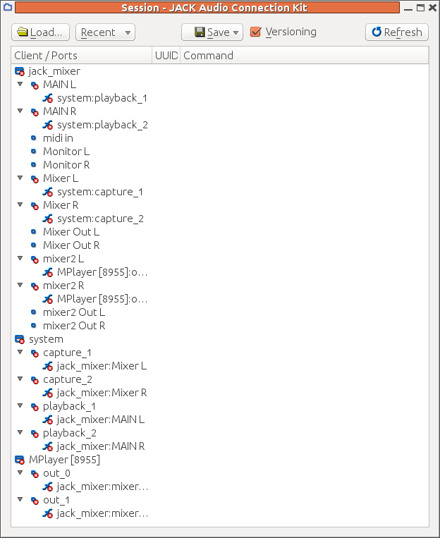

##  Jack sessions 


A list of Jack session aware applications as at 2010 is at [
	apps supporting jack-session 
      ](http://trac.jackaudio.org/wiki/WalkThrough/User/jack_session) and [
	Jack Session
      ](http://wiki.linuxaudio.org/apps/categories/jack_session) 


 `qjackctl`has a session manager which will allow you to save and restore sessions.
      You save a session by clicking on the Session button and then choosing a session
      name and directory.
      It stores the session information as an XML file in whatever directory you save it. For the session above,
      this looks like

```

	<!DOCTYPE qjackctlSession>
<session name="session2">
 <client name="jack_mixer">
  <port type="out" name="MAIN L">
   <connect port="playback_1" client="system"/>
  </port>
  <port type="out" name="MAIN R">
   <connect port="playback_2" client="system"/>
  </port>
  <port type="in" name="midi in"/>
  <port type="out" name="Monitor L"/>
  <port type="out" name="Monitor R"/>
  <port type="in" name="Mixer L">
   <connect port="capture_1" client="system"/>
  </port>
  <port type="in" name="Mixer R">
   <connect port="capture_2" client="system"/>
  </port>
  <port type="out" name="Mixer Out L"/>
  <port type="out" name="Mixer Out R"/>
  <port type="in" name="mixer2 L">
   <connect port="out_0" client="MPlayer [8955]"/>
  </port>
  <port type="in" name="mixer2 R">
   <connect port="out_1" client="MPlayer [8955]"/>
  </port>
  <port type="out" name="mixer2 Out L"/>
  <port type="out" name="mixer2 Out R"/>
 </client>
 <client name="system">
  <port type="out" name="capture_1">
   <connect port="Mixer L" client="jack_mixer"/>
  </port>
  <port type="out" name="capture_2">
   <connect port="Mixer R" client="jack_mixer"/>
  </port>
  <port type="in" name="playback_1">
   <connect port="MAIN L" client="jack_mixer"/>
  </port>
  <port type="in" name="playback_2">
   <connect port="MAIN R" client="jack_mixer"/>
  </port>
 </client>
 <client name="MPlayer [8955]">
  <port type="out" name="out_0">
   <connect port="mixer2 L" client="jack_mixer"/>
  </port>
  <port type="out" name="out_1">
   <connect port="mixer2 R" client="jack_mixer"/>
  </port>
 </client>
</session>


      
```


On loading the session, it looks like





There are many red crosses - restoring a session doesn't start these particular
      applications. If you re-start `jack_mixer`by hand, 
      then it establishes the links
      between its MAIN output ports and system playback ports, and several of the red crosses
      disappear. But it doesn't create the extra ports that we created earlier.
      We need to repeat the work of creating new input ports with the right names
      and then `qjackctl`does re-establish the connections, and more red
      crosses disappear.


If we run `mplayer`again, it just establishes its own default
      connections to the playback ports and has to be re-mapped by hand.
      It doesn't even seem to meet Level 0, as `qjackctl`doesn't remap its connections automatically.


The issue here is that the `mplayer`and `jack_mixer`do not talk the Jack session management protocol.
      The session manager does reset
      any connections made by some applications, but not all of them.
      An example is given later of adding Jack session management to an
      application and then it will be restarted and reconnected properly.
