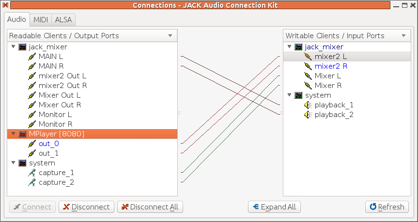

##  Session management issues 

Whenever there are multiple modules linked in some way, there can be a need to
manage the modules and their linkages. These arise quite quickly in the Jack
environment, which is designed for multiple linkages.
It doesn't take a very complex arrangement of Jack modules for management to become tedious.
For example, consider the mixer session of the previous chapter:

To set this up from the beginning requires

+ Start `jackd`and `qjackctl`
+ Start `jack_mixer`
+ Open up two new sets of input ports on the mixer
+ Connect the MAIN mixer output ports to the playback ports
+ Connect the microphone ports to one set of mixer input ports
+ Start `mplayer`, which automatically connects to the playback ports
+ Disconnect the `mplayer`output ports from the playback ports
and reconnect them to the other set of mixer input ports

You don't want to do this every time you play a song!

The LADISH session manager identifies [different levels of control of applications by session managers.](http://ladish.org/wiki/levels) Removing the explicit references to particular managers and frameworks, they are:

+ level 0 - an application is not linked to a session handling library.
User has to save application projects manually or rely on autosave support from application.
+ level 1 - an application is not linked to a session handling library.
Application saves when particular messages or signals are received.
+ level 2, an application is linked to a session management library.
Limited interaction with session handler because of limitations in the session manager
+ level 3 - an application is linked to a sophisticated session manager.
Full interaction with the session handler

As [Dave Phillips](http://lwn.net/Articles/533594) points out, "The use of these levels is an attempt to sort and regulate the various
possible conditions for any Linux audio application.
Those conditions include the degree of JACK compliance,
any WINE or DOS requirements, network operation, the multiplicity of existing APIs, and so forth. "

The current batch of session management frameworks
used for Linux audio includes

+ LASH
+ Jack session management
+ LADISH
+ Non-session manager
+ Chino

The existence of multiple managers means that most applications will only support
the protocols of only one or at most a few. If you choose a particular manager
then you will be restricted to the applications you can run under its control.
